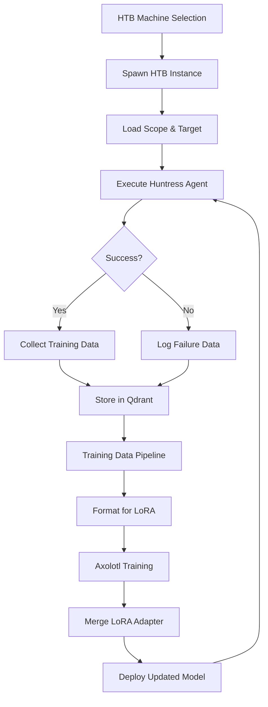

# Phase 5: HTB Training Loop with Local LoRA Training
## Implementation Plan & Technical Specification

**Version:** 1.0  
**Date:** 2025-11-23  
**Status:** Planning Phase  
**Priority:** 5 (After Phases 0-4 Complete)

---

## Executive Summary

Phase 5 implements a continuous learning system that trains Huntress agents on HackTheBox (HTB) machines to improve their autonomous penetration testing capabilities. Unlike traditional OpenAI fine-tuning (which is expensive and rejects security content), this system uses **local LoRA (Low-Rank Adaptation)** training on Llama-3.1-70B to create a specialized security-focused model.

**Key Innovation:** Every successful HTB machine completion becomes training data, creating a feedback loop where the agent learns from its own successes and failures.

**Target Outcome:** 65%+ success rate on new HTB machines (up from ~30% baseline).

---

## Table of Contents

1. [System Architecture](#1-system-architecture)
2. [HTB Runner Script Design](#2-htb-runner-script-design)
3. [Training Data Pipeline](#3-training-data-pipeline)
4. [Axolotl Integration](#4-axolotl-integration)
5. [Continuous Learning Loop](#5-continuous-learning-loop)
6. [Success Metrics](#6-success-metrics)
7. [Risk Mitigation](#7-risk-mitigation)
8. [Implementation Phases](#8-implementation-phases)
9. [Technical Specifications](#9-technical-specifications)
10. [Acceptance Criteria](#10-acceptance-criteria)

---

## 1. System Architecture

### 1.1 Overall Data Flow



### 1.2 Integration Points with Existing Systems

#### 1.2.1 Qdrant Vector Database
- **Location:** [`src/core/memory/qdrant_client.ts`](src/core/memory/qdrant_client.ts)
- **Purpose:** Store training examples with embeddings for semantic search
- **Collections:**
  - `training_data` - Successful hunt sessions
  - `failure_analysis` - Failed attempts with reasoning
  - `technique_library` - Extracted techniques and patterns

#### 1.2.2 CrewAI Supervisor
- **Location:** [`src/core/crewai/supervisor.ts`](src/core/crewai/supervisor.ts)
- **Integration:** Supervisor orchestrates HTB hunts and collects execution traces
- **Data Captured:**
  - Tool execution sequence
  - Reasoning at each step
  - Success/failure outcomes
  - Time to completion

#### 1.2.3 PTY Manager
- **Location:** [`src-tauri/src/pty_manager.rs`](src-tauri/src/pty_manager.rs)
- **Integration:** All command executions are recorded in asciinema format
- **Recording Path:** `recordings/{session_id}.cast`
- **Usage:** Provides complete audit trail of successful attacks

#### 1.2.4 Tool Executor
- **Location:** [`src/core/tools/tool_executor.ts`](src/core/tools/tool_executor.ts)
- **Integration:** Captures tool outputs and execution results
- **Data Collected:**
  - Command executed
  - Output received
  - Success/failure status
  - Execution time

### 1.3 Security Boundaries

```
┌─────────────────────────────────────────────────────────────┐
│                    SECURITY BOUNDARY                         │
│                                                              │
│  ┌────────────────────────────────────────────────────┐    │
│  │         LOCAL TRAINING ENVIRONMENT                  │    │
│  │                                                     │    │
│  │  • All training data stays local                   │    │
│  │  • No external API calls during training           │    │
│  │  • HTB credentials isolated                        │    │
│  │  • Model weights never leave system                │    │
│  │                                                     │    │
│  │  ┌──────────────┐      ┌──────────────┐          │    │
│  │  │   Qdrant     │◄────►│   Axolotl    │          │    │
│  │  │   (Local)    │      │   (Local)    │          │    │
│  │  └──────────────┘      └──────────────┘          │    │
│  │                                                     │    │
│  └────────────────────────────────────────────────────┘    │
│                                                              │
│  ┌────────────────────────────────────────────────────┐    │
│  │         HTB TESTING ENVIRONMENT                     │    │
│  │                                                     │    │
│  │  • Isolated network namespace                      │    │
│  │  • VPN connection to HTB                           │    │
│  │  • No access to production systems                 │    │
│  │  • Automatic cleanup after session                 │    │
│  │                                                     │    │
│  └────────────────────────────────────────────────────┘    │
│                                                              │
└─────────────────────────────────────────────────────────────┘
```

### 1.4 Data Isolation Requirements

1. **Training Data Isolation**
   - All HTB session data stored locally in Qdrant
   - No cloud backups of training data
   - Encrypted at rest using system encryption

2. **Model Isolation**
   - Base model downloaded once, cached locally
   - LoRA adapters stored in `models/huntress-lora-v{version}/`
   - No model telemetry or usage tracking

3. **Credential Isolation**
   - HTB API credentials in `.env` (gitignored)
   - VPN credentials stored in system keyring
   - No credential logging in training data

---

## 2. HTB Runner Script Design

### 2.1 Architecture Overview

The HTB Runner is a Python script that automates the complete cycle of:
1. Selecting an HTB machine
2. Spawning the instance
3. Running Huntress agent
4. Collecting results
5. Storing training data

### 2.2 Component Structure

```
scripts/htb_runner/
├── __init__.py
├── runner.py              # Main orchestration
├── htb_api.py            # HTB API client
├── machine_selector.py   # Machine selection logic
├── agent_executor.py     # Huntress agent wrapper
├── data_collector.py     # Training data extraction
├── config.py             # Configuration management
└── utils.py              # Helper functions
```

### 2.3 Machine Selection Strategy

```python
# scripts/htb_runner/machine_selector.py

from enum import Enum
from typing import List, Optional
import random

class Difficulty(Enum):
    EASY = "easy"
    MEDIUM = "medium"
    HARD = "hard"
    INSANE = "insane"

class MachineSelector:
    """
    Intelligent machine selection for training.
    
    Strategy:
    1. Start with Easy machines (build confidence)
    2. Progress to Medium (expand capabilities)
    3. Attempt Hard (push boundaries)
    4. Avoid Insane until 60%+ success rate
    """
    
    def __init__(self, qdrant_client, htb_api):
        self.qdrant = qdrant_client
        self.htb_api = htb_api
        self.success_history = []
    
    async def select_next_machine(self) -> dict:
        """
        Select next machine based on current performance.
        
        Returns:
            Machine metadata including ID, name, difficulty, OS
        """
        # Calculate current success rate
        success_rate = self._calculate_success_rate()
        
        # Determine target difficulty
        if success_rate < 0.40:
            target_difficulty = Difficulty.EASY
        elif success_rate < 0.60:
            target_difficulty = Difficulty.MEDIUM
        else:
            target_difficulty = Difficulty.HARD
        
        # Get machines we haven't attempted yet
        attempted_machines = await self._get_attempted_machines()
        
        # Fetch available machines from HTB
        available = await self.htb_api.list_machines(
            difficulty=target_difficulty.value,
            retired=True  # Use retired machines for training
        )
        
        # Filter out already attempted
        candidates = [
            m for m in available 
            if m['id'] not in attempted_machines
        ]
        
        if not candidates:
            # All machines at this difficulty attempted
            # Move to next difficulty or reset
            return await self._handle_no_candidates(target_difficulty)
        
        # Select machine with preference for:
        # 1. Similar OS to recent successes
        # 2. Vulnerability types we've succeeded with before
        selected = self._rank_and_select(candidates)
        
        return selected
    
    def _calculate_success_rate(self) -> float:
        """Calculate success rate from last 20 attempts."""
        if len(self.success_history) < 5:
            return 0.0
        
        recent = self.success_history[-20:]
        return sum(recent) / len(recent)
    
    async def _get_attempted_machines(self) -> List[int]:
        """Query Qdrant for machines we've already attempted."""
        results = await self.qdrant.search(
            collection_name="training_data",
            query_filter={"must": [{"key": "source", "match": {"value": "htb"}}]},
            limit=1000
        )
        
        return [r.payload['machine_id'] for r in results]
    
    def _rank_and_select(self, candidates: List[dict]) -> dict:
        """
        Rank candidates by similarity to past successes.
        
        Factors:
        - OS type (Linux/Windows)
        - Vulnerability categories
        - User ratings
        """
        # For now, random selection
        # TODO: Implement ML-based ranking
        return random.choice(candidates)
```

### 2.4 Agent Execution Wrapper

```python
# scripts/htb_runner/agent_executor.py

import asyncio
import json
from datetime import datetime
from typing import Dict, List, Optional

class AgentExecutor:
    """
    Wraps Huntress agent execution for HTB machines.
    
    Responsibilities:
    - Configure agent for HTB environment
    - Monitor execution progress
    - Detect success/failure
    - Collect execution trace
    """
    
    def __init__(self, config):
        self.config = config
        self.session_id = None
        self.start_time = None
        self.execution_trace = []
    
    async def execute_hunt(
        self,
        machine_ip: str,
        machine_info: dict,
        timeout: int = 7200  # 2 hours
    ) -> Dict:
        """
        Execute Huntress agent on HTB machine.
        
        Args:
            machine_ip: Target IP address
            machine_info: Machine metadata
            timeout: Maximum execution time in seconds
        
        Returns:
            Execution result with success status and collected data
        """
        self.session_id = f"htb_{machine_info['id']}_{int(datetime.now().timestamp())}"
        self.start_time = datetime.now()
        
        # Create scope file for this machine
        scope_file = await self._create_scope_file(machine_ip)
        
        # Configure agent
        agent_config = {
            'target': machine_ip,
            'scope_file': scope_file,
            'mode': 'training',
            'record_all': True,
            'model': self.config.model_name,
            'session_id': self.session_id,
            'max_iterations': 50,
            'timeout': timeout,
        }
        
        # Execute agent via Node.js subprocess
        result = await self._run_agent(agent_config)
        
        # Collect execution data
        execution_data = await self._collect_execution_data(result)
        
        return {
            'success': result['success'],
            'session_id': self.session_id,
            'machine_info': machine_info,
            'execution_time': (datetime.now() - self.start_time).total_seconds(),
            'flags_found': result.get('flags', []),
            'execution_trace': execution_data,
            'recording_path': f"recordings/{self.session_id}.cast",
        }
    
    async def _create_scope_file(self, machine_ip: str) -> str:
        """Create temporary scope file for HTB machine."""
        scope_path = f"/tmp/htb_scope_{self.session_id}.txt"
        with open(scope_path, 'w') as f:
            f.write(f"{machine_ip}\n")
        return scope_path
    
    async def _run_agent(self, config: dict) -> dict:
        """
        Run Huntress agent as subprocess.
        
        Executes: npm run agent -- --config {config_json}
        """
        # Write config to temp file
        config_path = f"/tmp/agent_config_{self.session_id}.json"
        with open(config_path, 'w') as f:
            json.dump(config, f)
        
        # Execute agent
        process = await asyncio.create_subprocess_exec(
            'npm', 'run', 'agent', '--',
            '--config', config_path,
            stdout=asyncio.subprocess.PIPE,
            stderr=asyncio.subprocess.PIPE,
            cwd=self.config.huntress_root
        )
        
        stdout, stderr = await process.communicate()
        
        # Parse result
        try:
            result = json.loads(stdout.decode())
        except json.JSONDecodeError:
            result = {
                'success': False,
                'error': 'Failed to parse agent output',
                'stdout': stdout.decode(),
                'stderr': stderr.decode(),
            }
        
        return result
    
    async def _collect_execution_data(self, result: dict) -> dict:
        """
        Collect comprehensive execution data for training.
        
        Includes:
        - Tool execution sequence
        - Reasoning at each step
        - Outputs and discoveries
        - Success/failure points
        """
        # Read PTY recording
        recording_path = f"recordings/{self.session_id}.cast"
        recording_data = await self._read_recording(recording_path)
        
        # Extract tool executions from logs
        tool_executions = await self._extract_tool_executions()
        
        # Get reasoning from agent logs
        reasoning = await self._extract_reasoning()
        
        return {
            'recording': recording_data,
            'tools': tool_executions,
            'reasoning': reasoning,
            'discoveries': result.get('discoveries', []),
            'vulnerabilities': result.get('vulnerabilities', []),
        }
```

### 2.5 Success/Failure Detection

```python
# scripts/htb_runner/data_collector.py

class SuccessDetector:
    """
    Determines if HTB machine was successfully compromised.
    
    Success Criteria:
    1. User flag obtained (user.txt)
    2. Root flag obtained (root.txt)
    3. Both flags validated via HTB API
    """
    
    def __init__(self, htb_api):
        self.htb_api = htb_api
    
    async def detect_success(
        self,
        machine_id: int,
        execution_result: dict
    ) -> dict:
        """
        Determine success level and validate flags.
        
        Returns:
            {
                'success': bool,
                'level': 'none' | 'user' | 'root',
                'user_flag': str | None,
                'root_flag': str | None,
                'validated': bool,
            }
        """
        flags = execution_result.get('flags_found', [])
        
        # Extract user and root flags
        user_flag = self._extract_flag(flags, 'user')
        root_flag = self._extract_flag(flags, 'root')
        
        # Validate flags via HTB API
        validation = await self._validate_flags(
            machine_id,
            user_flag,
            root_flag
        )
        
        # Determine success level
        if validation['root_valid']:
            level = 'root'
            success = True
        elif validation['user_valid']:
            level = 'user'
            success = True
        else:
            level = 'none'
            success = False
        
        return {
            'success': success,
            'level': level,
            'user_flag': user_flag,
            'root_flag': root_flag,
            'validated': validation['root_valid'] or validation['user_valid'],
            'validation_details': validation,
        }
    
    def _extract_flag(self, flags: List[str], flag_type: str) -> Optional[str]:
        """Extract user or root flag from list."""
        for flag in flags:
            if flag_type in flag.lower():
                # Extract hash (32 hex characters)
                import re
                match = re.search(r'[a-f0-9]{32}', flag)
                if match:
                    return match.group(0)
        return None
    
    async def _validate_flags(
        self,
        machine_id: int,
        user_flag: Optional[str],
        root_flag: Optional[str]
    ) -> dict:
        """Validate flags via HTB API."""
        validation = {
            'user_valid': False,
            'root_valid': False,
        }
        
        if user_flag:
            try:
                result = await self.htb_api.submit_flag(
                    machine_id,
                    user_flag,
                    difficulty=10  # User flag difficulty
                )
                validation['user_valid'] = result['success']
            except Exception as e:
                print(f"User flag validation failed: {e}")
        
        if root_flag:
            try:
                result = await self.htb_api.submit_flag(
                    machine_id,
                    root_flag,
                    difficulty=20  # Root flag difficulty
                )
                validation['root_valid'] = result['success']
            except Exception as e:
                print(f"Root flag validation failed: {e}")
        
        return validation
```

### 2.6 Main Runner Orchestration

```python
# scripts/htb_runner/runner.py

import asyncio
import logging
from datetime import datetime
from typing import Optional

class HTBRunner:
    """
    Main orchestrator for HTB training loop.
    
    Workflow:
    1. Select machine
    2. Spawn instance
    3. Execute agent
    4. Collect data
    5. Store in Qdrant
    6. Cleanup
    """
    
    def __init__(self, config):
        self.config = config
        self.htb_api = HTBAPIClient(config.htb_api_key)
        self.qdrant = QdrantClient(config.qdrant_url)
        self.selector = MachineSelector(self.qdrant, self.htb_api)
        self.executor = AgentExecutor(config)
        self.collector = DataCollector(self.qdrant)
        self.detector = SuccessDetector(self.htb_api)
        
        logging.basicConfig(level=logging.INFO)
        self.logger = logging.getLogger(__name__)
    
    async def run_single_session(self) -> dict:
        """
        Run a single HTB training session.
        
        Returns:
            Session result with success status and training data ID
        """
        session_start = datetime.now()
        
        try:
            # Step 1: Select machine
            self.logger.info("Selecting HTB machine...")
            machine = await self.selector.select_next_machine()
            self.logger.info(f"Selected: {machine['name']} ({machine['difficulty']})")
            
            # Step 2: Spawn instance
            self.logger.info("Spawning HTB instance...")
            instance = await self.htb_api.spawn_machine(machine['id'])
            machine_ip = instance['ip']
            self.logger.info(f"Instance spawned: {machine_ip}")
            
            # Wait for machine to be ready
            await asyncio.sleep(30)
            
            # Step 3: Execute agent
            self.logger.info("Executing Huntress agent...")
            execution_result = await self.executor.execute_hunt(
                machine_ip,
                machine
            )
            
            # Step 4: Detect success
            self.logger.info("Detecting success...")
            success_result = await self.detector.detect_success(
                machine['id'],
                execution_result
            )
            
            # Step 5: Collect and store training data
            self.logger.info("Collecting training data...")
            training_data = await self.collector.collect_training_data(
                machine,
                execution_result,
                success_result
            )
            
            # Store in Qdrant
            data_id = await self.collector.store_training_data(training_data)
            self.logger.info(f"Training data stored: {data_id}")
            
            # Step 6: Cleanup
            await self.htb_api.terminate_machine(machine['id'])
            
            session_duration = (datetime.now() - session_start).total_seconds()
            
            return {
                'success': success_result['success'],
                'machine': machine,
                'execution_time': execution_result['execution_time'],
                'session_duration': session_duration,
                'training_data_id': data_id,
                'flags_obtained': success_result['level'],
            }
            
        except Exception as e:
            self.logger.error(f"Session failed: {e}")
            return {
                'success': False,
                'error': str(e),
                'session_duration': (datetime.now() - session_start).total_seconds(),
            }
    
    async def run_continuous(
        self,
        max_sessions: Optional[int] = None,
        delay_between_sessions: int = 300  # 5 minutes
    ):
        """
        Run continuous training loop.
        
        Args:
            max_sessions: Maximum number of sessions (None = infinite)
            delay_between_sessions: Delay in seconds between sessions
        """
        session_count = 0
        
        while max_sessions is None or session_count < max_sessions:
            self.logger.info(f"\n{'='*60}")
            self.logger.info(f"Starting session {session_count + 1}")
            self.logger.info(f"{'='*60}\n")
            
            result = await self.run_single_session()
            
            session_count += 1
            
            # Log result
            if result['success']:
                self.logger.info(f"✅ Session {session_count} SUCCESS")
                self.logger.info(f"   Machine: {result['machine']['name']}")
                self.logger.info(f"   Flags: {result['flags_obtained']}")
                self.logger.info(f"   Time: {result['execution_time']:.1f}s")
            else:
                self.logger.info(f"❌ Session {session_count} FAILED")
                if 'error' in result:
                    self.logger.info(f"   Error: {result['error']}")
            
            # Check if we should trigger retraining
            if session_count % 10 == 0:
                self.logger.info("\n🔄 Triggering model retraining...")
                # TODO: Trigger Axolotl training
            
            # Delay before next session
            if max_sessions is None or session_count < max_sessions:
                self.logger.info(f"\nWaiting {delay_between_sessions}s before next session...")
                await asyncio.sleep(delay_between_sessions)


# CLI Entry Point
if __name__ == "__main__":
    import argparse
    
    parser = argparse.ArgumentParser(description="HTB Training Runner")
    parser.add_argument('--config', required=True, help='Config file path')
    parser.add_argument('--sessions', type=int, help='Max sessions (default: infinite)')
    parser.add_argument('--delay', type=int, default=300, help='Delay between sessions')
    
    args = parser.parse_args()
    
    # Load config
    config = Config.from_file(args.config)
    
    # Run
    runner = HTBRunner(config)
    asyncio.run(runner.run_continuous(
        max_sessions=args.sessions,
        delay_between_sessions=args.delay
    ))
```

---

## 3. Training Data Pipeline

### 3.1 Data Structure for Successful Hunts

```typescript
// src/core/training/types.ts

export interface TrainingExample {
  // Metadata
  id: string;
  timestamp: Date;
  source: 'htb' | 'bugbounty' | 'manual';
  
  // Target Information
  target: {
    type: 'htb_machine' | 'web_app' | 'api' | 'network';
    name: string;
    ip?: string;
    domain?: string;
    os?: 'linux' | 'windows' | 'other';
    difficulty?: 'easy' | 'medium' | 'hard' | 'insane';
  };
  
  // Vulnerability Information
  vulnerability: {
    type: string;  // e.g., 'sqli', 'xss', 'rce', 'lfi'
    severity: 'low' | 'medium' | 'high' | 'critical';
    cvss_score?: number;
    cwe_id?: string;
  };
  
  // Execution Trace
  execution: {
    session_id: string;
    start_time: Date;
    end_time: Date;
    duration_seconds: number;
    
    // Tool execution sequence
    tools_used: Array<{
      tool: string;
      command: string;
      timestamp: Date;
      output: string;
      success: boolean;
    }>;
    
    // AI reasoning at each step
    reasoning: Array<{
      step: number;
      thought: string;
      action: string;
      observation: string;
      timestamp: Date;
    }>;
    
    // Discoveries made
    discoveries: Array<{
      type: string;
      value: string;
      timestamp: Date;
      relevance: 'high' | 'medium' | 'low';
    }>;
  };
  
  // Success Metrics
  success: {
    achieved: boolean;
    level: 'none' | 'user' | 'root' | 'complete';
    flags_found: string[];
    time_to_user?: number;
    time_to_root?: number;
  };
  
  // Learning Signals
  learning: {
    // Techniques that worked
    successful_techniques: string[];
    
    // Dead ends avoided
    avoided_paths: string[];
    
    // Key insights
    insights: string[];
    
    // False positives encountered
    false_positives: number;
    
    // Pivots made
    pivots: Array<{
      from: string;
      to: string;
      reason: string;
    }>;
  };
  
  // Recording
  recording: {
    path: string;
    format: 'asciinema';
    duration: number;
  };
}
```

### 3.2 Data Cleaning and Validation

```typescript
// src/core/training/data_cleaner.ts

export class TrainingDataCleaner {
  /**
   * Clean and validate training data before storage.
   * 
   * Cleaning steps:
   * 1. Remove sensitive information (credentials, API keys)
   * 2. Normalize command outputs
   * 3. Extract key patterns
   * 4. Validate data completeness
   */
  
  async clean(rawData: any): Promise<TrainingExample> {
    // Step 1: Remove sensitive data
    const sanitized = this.removeSensitiveData(rawData);
    
    // Step 2: Normalize outputs
    const normalized = this.normalizeOutputs(sanitized);
    
    // Step 3: Extract patterns
    const withPatterns = this.extractPatterns(normalized);
    
    // Step 4: Validate
    this.validate(withPatterns);
    
    return withPatterns;
  }
  
  private removeSensitiveData(data: any): any {
    // Remove patterns that look like:
    // - Passwords
    // - API keys
    // - Session tokens
    // - Private keys
    
    const sensitivePatterns = [
      /password[=:]\s*\S+/gi,
      /api[_-]?key[=:]\s*\S+/gi,
      /token[=:]\s*\S+/gi,
      /-----BEGIN.*PRIVATE KEY-----[\s\S]*?-----END.*PRIVATE KEY-----/gi,
    ];
    
    let cleaned = JSON.stringify(data);
    
    for (const pattern of sensitivePatterns) {
      cleaned = cleaned.replace(pattern, '[REDACTED]');
    }
    
    return JSON.parse(cleaned);
  }
  
  private normalizeOutputs(data: any): any {
    // Normalize tool outputs:
    // - Remove ANSI color codes
    // - Standardize line endings
    // - Trim excessive whitespace
    
    if (data.execution?.tools_used) {
      for (const tool of data.execution.tools_used) {
        if (tool.output) {
          // Remove ANSI codes
          tool.output = tool.output.replace(/\x1b\[[0-9;]*m/g, '');
          
          // Normalize line endings
          tool.output = tool.output.replace(/\r\n/g, '\n');
          
          // Trim excessive whitespace
          tool.output = tool.output.replace(/\n{3,}/g, '\n\n');
        }
      }
    }
    
    return data;
  }
  
  private extractPatterns(data: any): any {
    // Extract reusable patterns:
    // - Command sequences that led to success
    // - Reconnaissance patterns
    // - Exploitation patterns
    
    if (data.success.achieved && data.execution.tools_used) {
      const patterns = [];
      
      // Extract successful command sequences
      const tools = data.execution.tools_used.filter(t => t.success);
      for (let i = 0; i < tools.length - 1; i++) {
        patterns.push({
          sequence: [tools[i].tool, tools[i + 1].tool],
          context: data.target.type,
        });
      }
      
      data.learning.patterns = patterns;
    }
    
    return data;
  }
  
  private validate(data: TrainingExample): void {
    // Validate required fields
    const required = [
      'id',
      'timestamp',
      'target',
      'execution',
      'success',
    ];
    
    for (const field of required) {
      if (!(field in data)) {
        throw new Error(`Missing required field: ${field}`);
      }
    }
    
    // Validate execution trace
    if (!data.execution.tools_used || data.execution.tools_used.length === 0) {
      throw new Error('No tools used in execution trace');
    }
    
    // Validate success data
    if (data.success.achieved && !data.success.flags_found.length) {
      throw new Error('Success claimed but no flags found');
    }
  }
}
```

### 3.3 Storage Format and Organization

```typescript
// src/core/training/storage.ts

export class TrainingDataStorage {
  constructor(private qdrant: QdrantClient) {}
  
  /**
   * Store training example in Qdrant with proper indexing.
   */
  async store(example: TrainingExample): Promise<string> {
    // Generate embedding for semantic search
    const embedding = await this.generateEmbedding(example);
    
    // Create point for Qdrant
    const point: VectorPoint = {
      id: example.id,
      vector: embedding,
      payload: {
        // Metadata for filtering
        source: example.source,
        target_type: example.target.type,
        target_os: example.target.os,
        difficulty: example.target.difficulty,
        vulnerability_type: example.vulnerability.type,
        severity: example.vulnerability.severity,
        success: example.success.achieved,
        success_level: example.success.level,
        
        // Timestamps for temporal queries
        timestamp: example.timestamp.toISOString(),
        duration: example.execution.duration_seconds,
        
        // Learning signals
        techniques: example.learning.successful_techniques,
        tools_count: example.execution.tools_used.length,
        
        // Full data
        data: example,
      },
    };
    
    // Store in Qdrant
    await this.qdrant.upsertPoint(point);
    
    return example.id;
  }
  
  /**
   * Generate embedding for training example.
   * 
   * Combines:
   * - Target description
   * - Vulnerability type
   * - Successful techniques
   * - Key reasoning steps
   */
  private async generateEmbedding(example: TrainingExample): Promise<number[]> {
    // Create text representation
    const text = this.createTextRepresentation(example);
    
    // Generate embedding using OpenAI or local model
    // For now, using OpenAI ada-002
    const response = await fetch('https://api.openai.com/v1/embeddings', {
      method: 'POST',
      headers: {
        'Authorization': `Bearer ${process.env.OPENAI_API_KEY}`,
        'Content-Type': 'application/json',
      },
      body: JSON.stringify({
        model: 'text-embedding-ada-002',
        input: text,
      }),
    });
    
    const data = await response.json();
    return data.data[0].embedding;
  }
  
  private createTextRepresentation(example: TrainingExample): string {
    const parts = [
      `Target: ${example.target.type} ${example.target.name}`,
      `OS: ${example.target.os || 'unknown'}`,
      `Vulnerability: ${example.vulnerability.type}`,
      `Severity: ${example.vulnerability.severity}`,
      `Techniques: ${example.learning.successful_techniques.join(', ')}`,
      `Tools: ${example.execution.tools_used.map(t => t.tool).join(' -> ')}`,
    ];
    
    // Add key reasoning steps
    if (example.execution.reasoning.length > 0) {
      const keySteps = example.execution.reasoning
        .filter(r => r.observation.length > 0)
        .slice(0, 5)  // Top 5 steps
        .map(r => r.thought);
      
      parts.push(`Reasoning: ${keySteps.join('. ')}`);
    }
    
    return parts.join('\n');
  }
  
  /**
   * Query similar training examples.
   */
  async findSimilar(
    query: Partial<TrainingExample>,
    limit: number = 10
  ): Promise<TrainingExample[]> {
    // Generate embedding for query
    const queryEmbedding = await this.generateEmbedding(query as TrainingExample);
    
    // Build filter
    const filter: any = {
      must: [],
    };
    
    if (query.target?.type) {
      filter.must.push({
        key: 'target_type',
        match: { value: query.target.type },
      });
    }
    
    if (query.success?.achieved !== undefined) {
      filter.must.push({
        key: 'success',
        match: { value: query.success.achieved },
      });
    }
    
    // Search Qdrant
    const results = await this.qdrant.searchWithFilter(
      queryEmbedding,
      filter,
      limit
    );
    
    return results.map(r => r.payload.data as TrainingExample);
  }
}
```

### 3.4 Quality Metrics and Filtering

```typescript
// src/core/training/quality_filter.ts

export interface QualityMetrics {
  completeness: number;      // 0-1: How complete is the data?
  clarity: number;           // 0-1: How clear is the reasoning?
  efficiency: number;        // 0-1: How efficient was the approach?
  novelty: number;           // 0-1: How novel is this technique?
  reliability: number;       // 0-1: How reliable is this approach?
  overall: number;           // 0-1: Overall quality score
}

export class QualityFilter {
  /**
   * Calculate quality metrics for training example.
   */
  calculateMetrics(example: TrainingExample): QualityMetrics {
    const completeness = this.assessCompleteness(example);
    const clarity = this.assessClarity(example);
    const efficiency = this.assessEfficiency(example);
    const novelty = this.assessNovelty(example);
    const reliability = this.assessReliability(example);
    
    const overall = (
      completeness * 0.3 +
      clarity * 0.2 +
      efficiency * 0.2 +
      novelty * 0.15 +
      reliability * 0.15
    );
    
    return {
      completeness,
      clarity,
      efficiency,
      novelty,
      reliability,
      overall,
    };
  }
  
  /**
   * Filter training examples by quality threshold.
   */
  filter(
    examples: TrainingExample[],
    minQuality: number = 0.6
  ): TrainingExample[] {
    return examples.filter(example => {
      const metrics = this.calculateMetrics(example);
      return metrics.overall >= minQuality;
    });
  }
  
  private assessCompleteness(example: TrainingExample): number {
    let score = 0;
    
    // Has execution trace?
    if (example.execution.tools_used.length > 0) score += 0.3;
    
    // Has reasoning?
    if (example.execution.reasoning.length > 0) score += 0.3;
    
    // Has discoveries?
    if (example.execution.discoveries.length > 0) score += 0.2;
    
    // Has recording?
    if (example.recording?.path) score += 0.2;
    
    return Math.min(score, 1.0);
  }
  
  private assessClarity(example: TrainingExample): number {
    // Assess clarity of reasoning steps
    if (example.execution.reasoning.length === 0) return 0;
    
    const avgReasoningLength = example.execution.reasoning
      .map(r => r.thought.length)
      .reduce((a, b) => a + b, 0) / example.execution.reasoning.length;
    
    // Good reasoning is 50-200 characters
    if (avgReasoningLength < 20) return 0.3;
    if (avgReasoningLength < 50) return 0.6;
    if (avgReasoningLength > 300) return 0.7;
    return 1.0;
  }
  
  private assessEfficiency(example: TrainingExample): number {
    if (!example.success.achieved) return 0;
    
    // Fewer tools = more efficient
    const toolCount = example.execution.tools_used.length;
    if (toolCount < 5) return 1.0;
    if (toolCount < 10) return 0.8;
    if (toolCount < 20) return 0.6;
    return 0.4;
  }
  
  private assessNovelty(example: TrainingExample): number {
    // Check if techniques are novel
    // This requires comparing against existing training data
    // For now, return 0.5 (neutral)
    return 0.5;
  }
  
  private assessReliability(example: TrainingExample): number {
    // Assess reliability based on:
    // - False positives encountered
    // - Number of pivots needed
    
    let score = 1.0;
    
    // Penalize false positives
    if (example.learning.false_positives > 0) {
      score -= example.learning.false_positives * 0.1;
    }
    
    // Penalize excessive pivots
    if (example.learning.pivots.length > 3) {
      score -= (example.learning.pivots.length - 3) * 0.1;
    }
    
    return Math.max(score, 0);
  }
}
```

---

## 4. Axolotl Integration

### 4.1 Installation Requirements

```bash
# scripts/setup_axolotl.sh

#!/bin/bash
set -e

echo "🔧 Setting up Axolotl for LoRA training..."

# Check GPU availability
if ! command -v nvidia-smi &> /dev/null; then
    echo "❌ NVIDIA GPU not detected. Axolotl requires CUDA-capable GPU."
    exit 1
fi

# Check CUDA version
CUDA_VERSION=$(nvidia-smi | grep "CUDA Version" | awk '{print $9}')
echo "✅ CUDA Version: $CUDA_VERSION"

# Create virtual environment
python3 -m venv venv/axolotl
source venv/axolotl/bin/activate

# Install PyTorch with CUDA support
pip install torch torchvision torchaudio --index-url https://download.pytorch.org/whl/cu118

# Clone and install Axolotl
git clone https://github.com/OpenAccess-AI-Collective/axolotl.git
cd axolotl
pip install -e .
pip install -U git+https://github.com/huggingface/peft.git

# Install additional dependencies
pip install transformers accelerate bitsandbytes scipy

# Download base model (Llama-3.1-70B)
echo "📥 Downloading Llama-3.1-70B base model..."
huggingface-cli login  # Requires HuggingFace token
huggingface-cli download meta-llama/Llama-3.1-70B-Instruct --local-dir models/llama-3.1-70b

echo "✅ Axolotl setup complete!"
```

### 4.2 Configuration for Llama-3.1-70B

```yaml
# config/axolotl_config.yml

# Base Model Configuration
base_model: ./models/llama-3.1-70b
model_type: LlamaForCausalLM
tokenizer_type: AutoTokenizer
trust_remote_code: true

# LoRA Configuration
adapter: lora
lora_model_dir:  # Leave empty for new training
lora_r: 32                    # LoRA rank (higher = more parameters)
lora_alpha: 16                # LoRA alpha (scaling factor)
lora_dropout: 0.05            # Dropout for LoRA layers
lora_target_modules:          # Which modules to apply LoRA to
  - q_proj                    # Query projection
  - v_proj                    # Value projection
  - k_proj                    # Key projection
  - o_proj                    # Output projection
  - gate_proj                 # Gate projection (for Llama)
  - up_proj                   # Up projection
  - down_proj                 # Down projection

# Quantization (for memory efficiency)
load_in_8bit: true            # Use 8-bit quantization
load_in_4bit: false           # 4-bit is too aggressive for security tasks

# Training Configuration
sequence_len: 4096            # Maximum sequence length
sample_packing: true          # Pack multiple samples per sequence
pad_to_sequence_len: true

# Dataset Configuration
datasets:
  - path: ./training_data/htb_sessions.jsonl
    type: completion          # Completion-style training
    field: text               # Field containing training text

# Training Hyperparameters
num_epochs: 3                 # Number of training epochs
micro_batch_size: 2           # Batch size per GPU
gradient_accumulation_steps: 4  # Accumulate gradients
learning_rate: 0.0002         # Learning rate
lr_scheduler: cosine          # Learning rate scheduler
warmup_steps: 100             # Warmup steps

# Optimizer
optimizer: adamw_torch
weight_decay: 0.01

# Logging
logging_steps: 10
eval_steps: 50
save_steps: 100
output_dir: ./models/huntress-lora-v1

# Evaluation
val_set_size: 0.1             # 10% validation split
eval_table_size: 5            # Number of examples to log

# Hardware Optimization
gradient_checkpointing: true  # Save memory
fp16: true                    # Use mixed precision
tf32: true                    # Use TF32 on Ampere GPUs

# Early Stopping
early_stopping_patience: 3    # Stop if no improvement for 3 evals

# Special Tokens
special_tokens:
  bos_token: "<|begin_of_text|>"
  eos_token: "<|end_of_text|>"
  pad_token: "<|end_of_text|>"
```

### 4.3 LoRA Training Parameters

**Parameter Selection Rationale:**

1. **LoRA Rank (r=32)**
   - Higher rank = more expressive but more parameters
   - 32 is a good balance for complex security reasoning
   - Can be reduced to 16 for faster training

2. **LoRA Alpha (α=16)**
   - Controls scaling of LoRA updates
   - α/r = 0.5 is standard ratio
   - Lower values = more conservative updates

3. **Dropout (0.05)**
   - Prevents overfitting
   - 5% is conservative for security tasks
   - Can increase to 0.1 if overfitting observed

4. **Target Modules**
   - Applying LoRA to all attention projections
   - Also including MLP layers (gate, up, down)
   - Maximizes adaptation capability

5. **8-bit Quantization**
   - Reduces memory from ~140GB to ~70GB
   - Minimal impact on quality
   - Essential for single-GPU training

### 4.4 Training Schedule

```python
# scripts/training/schedule.py

from dataclasses import dataclass
from typing import List
import schedule
import time

@dataclass
class TrainingSchedule:
    """
    Training schedule configuration.
    """
    # Trigger conditions
    min_new_examples: int = 10        # Minimum new examples before training
    max_days_since_training: int = 7  # Maximum days between trainings
    
    # Training windows
    preferred_hours: List[int] = None  # Hours to run training (0-23)
    
    # Resource limits
    max_training_hours: int = 12      # Maximum training duration
    gpu_memory_threshold: float = 0.8  # Don't train if GPU >80% used

class TrainingScheduler:
    """
    Manages training schedule and triggers.
    """
    
    def __init__(self, config: TrainingSchedule):
        self.config = config
        self.last_training = None
        self.new_examples_count = 0
    
    def should_trigger_training(self) -> bool:
        """
        Determine if training should be triggered.
        
        Triggers when:
        1. Enough new examples accumulated, OR
        2. Too long since last training
        """
        # Check new examples threshold
        if self.new_examples_count >= self.config.min_new_examples:
            return True
        
        # Check time threshold
        if self.last_training:
            days_since = (datetime.now() - self.last_training).days
            if days_since >= self.config.max_days_since_training:
                return True
        
        return False
    
    def can_train_now(self) -> bool:
        """
        Check if training can start now.
        
        Considers:
        - Preferred training hours
        - GPU availability
        """
        current_hour = datetime.now().hour
        
        # Check preferred hours
        if self.config.preferred_hours:
            if current_hour not in self.config.preferred_hours:
                return False
        
        # Check GPU availability
        gpu_usage = self.get_gpu_usage()
        if gpu_usage > self.config.gpu_memory_threshold:
            return False
        
        return True
    
    def get_gpu_usage(self) -> float:
        """Get current GPU memory usage (0-1)."""
        import subprocess
        result = subprocess.run(
            ['nvidia-smi', '--query-gpu=memory.used,memory.total', '--format=csv,noheader,nounits'],
            capture_output=True,
            text=True
        )
        
        if result.returncode != 0:
            return 1.0  # Assume full if can't check
        
        used, total = map(float, result.stdout.strip().split(','))
        return used / total
    
    def schedule_training(self):
        """
        Set up scheduled training checks.
        """
        # Check every hour if training should be triggered
        schedule.every().hour.do(self.check_and_train)
        
        # Run scheduler
        while True:
            schedule.run_pending()
            time.sleep(60)
    
    def check_and_train(self):
        """
        Check if training should run and execute if conditions met.
        """
        if self.should_trigger_training() and self.can_train_now():
            print("🔄 Triggering training...")
            self.run_training()
    
    def run_training(self):
        """
        Execute training pipeline.
        """
        from training_pipeline import TrainingPipeline
        
        pipeline = TrainingPipeline()
        pipeline.run()
        
        # Update state
        self.last_training = datetime.now()
        self.new_examples_count = 0
```

### 4.5 Resource Requirements

**Minimum Hardware:**
- GPU: NVIDIA RTX 3090 (24GB VRAM) or better
- RAM: 64GB system RAM
- Storage: 500GB SSD (for models and training data)
- CPU: 8+ cores

**Recommended Hardware:**
- GPU: NVIDIA A100 (40GB/80GB) or H100
- RAM: 128GB system RAM
- Storage: 1TB NVMe SSD
- CPU: 16+ cores

**Training Time Estimates:**
- 10 examples: ~30 minutes
- 100 examples: ~3 hours
- 1000 examples: ~24 hours

**Memory Usage:**
- Base model (8-bit): ~70GB
- LoRA adapters: ~2GB
- Training overhead: ~10GB
- **Total: ~82GB** (fits in A100 80GB)

---

## 5. Continuous Learning Loop

### 5.1 Trigger Conditions for Retraining

```typescript
// src/core/training/triggers.ts

export interface RetrainingTrigger {
  type: 'threshold' | 'schedule' | 'performance' | 'manual';
  condition: string;
  met: boolean;
}

export class RetrainingTriggerManager {
  private qdrant: QdrantClient;
  private lastTraining: Date | null = null;
  
  constructor(qdrant: QdrantClient) {
    this.qdrant = qdrant;
  }
  
  /**
   * Check all trigger conditions.
   */
  async checkTriggers(): Promise<RetrainingTrigger[]> {
    const triggers: RetrainingTrigger[] = [];
    
    // Trigger 1: New examples threshold
    const newExamplesCount = await this.getNewExamplesCount();
    triggers.push({
      type: 'threshold',
      condition: `${newExamplesCount} new examples (threshold: 10)`,
      met: newExamplesCount >= 10,
    });
    
    // Trigger 2: Time-based schedule
    const daysSinceTraining = this.getDaysSinceLastTraining();
    triggers.push({
      type: 'schedule',
      condition: `${daysSinceTraining} days since last training (max: 7)`,
      met: daysSinceTraining >= 7,
    });
    
    // Trigger 3: Performance degradation
    const performanceDecline = await this.detectPerformanceDecline();
    triggers.push({
      type: 'performance',
      condition: `Performance decline: ${performanceDecline.toFixed(2)}% (threshold: 10%)`,
      met: performanceDecline >= 10,
    });
    
    return triggers;
  }
  
  /**
   * Should retraining be triggered?
   */
  async shouldRetrain(): Promise<boolean> {
    const triggers = await this.checkTriggers();
    return triggers.some(t => t.met);
  }
  
  private async getNewExamplesCount(): Promise<number> {
    // Query Qdrant for examples added since last training
    const results = await this.qdrant.search(
      collection_name: 'training_data',
      query_filter: {
        must: [
          {
            key: 'timestamp',
            range: {
              gte: this.lastTraining?.toISOString() || '1970-01-01',
            },
          },
        ],
      },
      limit: 1000,
    );
    
    return results.length;
  }
  
  private getDaysSinceLastTraining(): number {
    if (!this.lastTraining) return Infinity;
    
    const now = new Date();
    const diff = now.getTime() - this.lastTraining.getTime();
    return Math.floor(diff / (1000 * 60 * 60 * 24));
  }
  
  private async detectPerformanceDecline(): Promise<number> {
    // Compare recent success rate to historical average
    const recentRate = await this.getRecentSuccessRate(20);
    const historicalRate = await this.getHistoricalSuccessRate();
    
    if (historicalRate === 0) return 0;
    
    const decline = ((historicalRate - recentRate) / historicalRate) * 100;
    return Math.max(decline, 0);
  }
  
  private async getRecentSuccessRate(count: number): Promise<number> {
    const results = await this.qdrant.search(
      collection_name: 'training_data',
      query_filter: {},
      limit: count,
      order_by: 'timestamp',
    );
    
    if (results.length === 0) return 0;
    
    const successes = results.filter(r => r.payload.success).length;
    return successes / results.length;
  }
  
  private async getHistoricalSuccessRate(): Promise<number> {
    const results = await this.qdrant.search(
      collection_name: 'training_data',
      query_filter: {},
      limit: 100,
    );
    
    if (results.length === 0) return 0;
    
    const successes = results.filter(r => r.payload.success).length;
    return successes / results.length;
  }
}
```

### 5.2 Model Versioning and Rollback Strategy

```typescript
// src/core/training/versioning.ts

export interface ModelVersion {
  version: string;
  timestamp: Date;
  baseModel: string;
  loraPath: string;
  trainingExamples: number;
  performance: {
    successRate: number;
    avgTimeToSuccess: number;
    falsePositiveRate: number;
  };
  status: 'training' | 'testing' | 'production' | 'archived';
}

export class ModelVersionManager {
  private versions: Map<string, ModelVersion> = new Map();
  private currentProduction: string | null = null;
  
  /**
   * Register new model version.
   */
  async registerVersion(
    loraPath: string,
    trainingExamples: number
  ): Promise<string> {
    const version = this.generateVersionString();
    
    const modelVersion: ModelVersion = {
      version,
      timestamp: new Date(),
      baseModel: 'llama-3.1-70b',
      loraPath,
      trainingExamples,
      performance: {
        successRate: 0,
        avgTimeToSuccess: 0,
        falsePositiveRate: 0,
      },
      status: 'training',
    };
    
    this.versions.set(version, modelVersion);
    
    // Save to disk
    await this.saveVersionMetadata(modelVersion);
    
    return version;
  }
  
  /**
   * Promote version to testing.
   */
  async promoteToTesting(version: string): Promise<void> {
    const model = this.versions.get(version);
    if (!model) throw new Error(`Version ${version} not found`);
    
    model.status = 'testing';
    await this.saveVersionMetadata(model);
  }
  
  /**
   * Promote version to production.
   */
  async promoteToProduction(version: string): Promise<void> {
    const model = this.versions.get(version);
    if (!model) throw new Error(`Version ${version} not found`);
    
    // Archive current production
    if (this.currentProduction) {
      const current = this.versions.get(this.currentProduction);
      if (current) {
        current.status = 'archived';
        await this.saveVersionMetadata(current);
      }
    }
    
    // Promote new version
    model.status = 'production';
    this.currentProduction = version;
    
    await this.saveVersionMetadata(model);
    
    // Update symlink to point to new model
    await this.updateProductionSymlink(model.loraPath);
  }
  
  /**
   * Rollback to previous version.
   */
  async rollback(): Promise<string> {
    // Find most recent archived version
    const archived = Array.from(this.versions.values())
      .filter(v => v.status === 'archived')
      .sort((a, b) => b.timestamp.getTime() - a.timestamp.getTime());
    
    if (archived.length === 0) {
      throw new Error('No previous version to rollback to');
    }
    
    const previous = archived[0];
    
    // Demote current production
    if (this.currentProduction) {
      const current = this.versions.get(this.currentProduction);
      if (current) {
        current.status = 'archived';
        await this.saveVersionMetadata(current);
      }
    }
    
    // Promote previous version
    await this.promoteToProduction(previous.version);
    
    return previous.version;
  }
  
  /**
   * Update performance metrics for version.
   */
  async updatePerformance(
    version: string,
    metrics: Partial<ModelVersion['performance']>
  ): Promise<void> {
    const model = this.versions.get(version);
    if (!model) throw new Error(`Version ${version} not found`);
    
    model.performance = {
      ...model.performance,
      ...metrics,
    };
    
    await this.saveVersionMetadata(model);
  }
  
  /**
   * Get current production version.
   */
  getCurrentProduction(): ModelVersion | null {
    if (!this.currentProduction) return null;
    return this.versions.get(this.currentProduction) || null;
  }
  
  /**
   * List all versions.
   */
  listVersions(status?: ModelVersion['status']): ModelVersion[] {
    const versions = Array.from(this.versions.values());
    
    if (status) {
      return versions.filter(v => v.status === status);
    }
    
    return versions.sort((a, b) => b.timestamp.getTime() - a.timestamp.getTime());
  }
  
  private generateVersionString(): string {
    const date = new Date();
    const dateStr = date.toISOString().split('T')[0].replace(/-/g, '');
    const timeStr = date.toTimeString().split(' ')[0].replace(/:/g, '');
    return `v${dateStr}-${timeStr}`;
  }
  
  private async saveVersionMetadata(version: ModelVersion): Promise<void> {
    const fs = require('fs').promises;
    const path = `models/versions/${version.version}.json`;
    await fs.writeFile(path, JSON.stringify(version, null, 2));
  }
  
  private async updateProductionSymlink(loraPath: string): Promise<void> {
    const fs = require('fs').promises;
    const symlinkPath = 'models/production';
    
    // Remove existing symlink
    try {
      await fs.unlink(symlinkPath);
    } catch (e) {
      // Ignore if doesn't exist
    }
    
    // Create new symlink
    await fs.symlink(loraPath, symlinkPath);
  }
}
```

### 5.3 A/B Testing Framework

```typescript
// src/core/training/ab_testing.ts

export interface ABTest {
  id: string;
  name: string;
  startDate: Date;
  endDate?: Date;
  
  // Models being compared
  modelA: {
    version: string;
    name: string;
  };
  modelB: {
    version: string;
    name: string;
  };
  
  // Traffic split (0-1)
  trafficSplit: number;  // % of traffic to model B
  
  // Results
  results: {
    modelA: ABTestMetrics;
    modelB: ABTestMetrics;
  };
  
  // Status
  status: 'running' | 'completed' | 'cancelled';
  winner?: 'A' | 'B' | 'tie';
}

export interface ABTestMetrics {
  attempts: number;
  successes: number;
  successRate: number;
  avgTimeToSuccess: number;
  falsePositives: number;
  falsePositiveRate: number;
}

export class ABTestingFramework {
  private activeTest: ABTest | null = null;
  
  /**
   * Start A/B test between two models.
   */
  async startTest(
    modelA: string,
    modelB: string,
    trafficSplit: number = 0.5,
    name?: string
  ): Promise<string> {
    if (this.activeTest) {
      throw new Error('An A/B test is already running');
    }
    
    const test: ABTest = {
      id: `test_${Date.now()}`,
      name: name || `${modelA} vs ${modelB}`,
      startDate: new Date(),
      modelA: { version: modelA, name: 'Control' },
      modelB: { version: modelB, name: 'Treatment' },
      trafficSplit,
      results: {
        modelA: this.createEmptyMetrics(),
        modelB: this.createEmptyMetrics(),
      },
      status: 'running',
    };
    
    this.activeTest = test;
    
    return test.id;
  }
  
  /**
   * Select which model to use for this request.
   */
  selectModel(): 'A' | 'B' {
    if (!this.activeTest) return 'A';
    
    // Random selection based on traffic split
    return Math.random() < this.activeTest.trafficSplit ? 'B' : 'A';
  }
  
  /**
   * Record result for A/B test.
   */
  async recordResult(
    model: 'A' | 'B',
    success: boolean,
    timeToSuccess: number,
    falsePositives: number
  ): Promise<void> {
    if (!this.activeTest) return;
    
    const metrics = model === 'A' 
      ? this.activeTest.results.modelA 
      : this.activeTest.results.modelB;
    
    metrics.attempts++;
    if (success) {
      metrics.successes++;
      metrics.avgTimeToSuccess = (
        (metrics.avgTimeToSuccess * (metrics.successes - 1) + timeToSuccess) /
        metrics.successes
      );
    }
    metrics.falsePositives += falsePositives;
    
    // Recalculate rates
    metrics.successRate = metrics.successes / metrics.attempts;
    metrics.falsePositiveRate = metrics.falsePositives / metrics.attempts;
  }
  
  /**
   * Check if test has statistical significance.
   */
  hasStatisticalSignificance(): boolean {
    if (!this.activeTest) return false;
    
    const { modelA, modelB } = this.activeTest.results;
    
    // Need at least 30 attempts per model
    if (modelA.attempts < 30 || modelB.attempts < 30) {
      return false;
    }
    
    // Calculate z-score for success rate difference
    const p1 = modelA.successRate;
    const p2 = modelB.successRate;
    const n1 = modelA.attempts;
    const n2 = modelB.attempts;
    
    const pooledP = (p1 * n1 + p2 * n2) / (n1 + n2);
    const se = Math.sqrt(pooledP * (1 - pooledP) * (1/n1 + 1/n2));
    const zScore = Math.abs(p1 - p2) / se;
    
    // z-score > 1.96 = 95% confidence
    return zScore > 1.96;
  }
  
  /**
   * Determine winner of A/B test.
   */
  determineWinner(): 'A' | 'B' | 'tie' {
    if (!this.activeTest) return 'tie';
    
    const { modelA, modelB } = this.activeTest.results;
    
    // Compare success rates
    if (modelB.successRate > modelA.successRate * 1.05) {
      // Model B is at least 5% better
      return 'B';
    } else if (modelA.successRate > modelB.successRate * 1.05) {
      // Model A is at least 5% better
      return 'A';
    }
    
    return 'tie';
  }
  
  /**
   * Complete A/B test.
   */
  async completeTest(): Promise<ABTest> {
    if (!this.activeTest) {
      throw new Error('No active test');
    }
    
    this.activeTest.endDate = new Date();
    this.activeTest.status = 'completed';
    this.activeTest.winner = this.determineWinner();
    
    const completedTest = this.activeTest;
    this.activeTest = null;
    
    // Save results
    await this.saveTestResults(completedTest);
    
    return completedTest;
  }
  
  /**
   * Get current test status.
   */
  getTestStatus(): ABTest | null {
    return this.activeTest;
  }
  
  private createEmptyMetrics(): ABTestMetrics {
    return {
      attempts: 0,
      successes: 0,
      successRate: 0,
      avgTimeToSuccess: 0,
      falsePositives: 0,
      falsePositiveRate: 0,
    };
  }
  
  private async saveTestResults(test: ABTest): Promise<void> {
    const fs = require('fs').promises;
    const path = `models/ab_tests/${test.id}.json`;
    await fs.writeFile(path, JSON.stringify(test, null, 2));
  }
}
```

### 5.4 Performance Monitoring

```typescript
// src/core/training/monitoring.ts

export interface PerformanceMetrics {
  timestamp: Date;
  modelVersion: string;
  
  // Success metrics
  successRate: number;
  avgTimeToSuccess: number;
  medianTimeToSuccess: number;
  
  // Quality metrics
  falsePositiveRate: number;
  duplicateRate: number;
  
  // Efficiency metrics
  avgToolsUsed: number;
  avgIterations: number;
  
  // Learning metrics
  novelTechniques: number;
  techniqueReuse: number;
}

export class PerformanceMonitor {
  private metrics: PerformanceMetrics[] = [];
  private qdrant: QdrantClient;
  
  constructor(qdrant: QdrantClient) {
    this.qdrant = qdrant;
  }
  
  /**
   * Collect current performance metrics.
   */
  async collectMetrics(modelVersion: string): Promise<PerformanceMetrics> {
    // Query recent sessions (last 50)
    const sessions = await this.getRecentSessions(50);
    
    const metrics: PerformanceMetrics = {
      timestamp: new Date(),
      modelVersion,
      successRate: this.calculateSuccessRate(sessions),
      avgTimeToSuccess: this.calculateAvgTime(sessions),
      medianTimeToSuccess: this.calculateMedianTime(sessions),
      falsePositiveRate: this.calculateFalsePositiveRate(sessions),
      duplicateRate: this.calculateDuplicateRate(sessions),
      avgToolsUsed: this.calculateAvgTools(sessions),
      avgIterations: this.calculateAvgIterations(sessions),
      novelTechniques: this.countNovelTechniques(sessions),
      techniqueReuse: this.calculateTechniqueReuse(sessions),
    };
    
    this.metrics.push(metrics);
    
    // Save to disk
    await this.saveMetrics(metrics);
    
    return metrics;
  }
  
  /**
   * Get performance trend over time.
   */
  getTrend(metric: keyof PerformanceMetrics, days: number = 30): number[] {
    const cutoff = new Date();
    cutoff.setDate(cutoff.getDate() - days);
    
    return this.metrics
      .filter(m => m.timestamp >= cutoff)
      .map(m => m[metric] as number);
  }
  
  /**
   * Detect performance regression.
   */
  detectRegression(): {
    detected: boolean;
    metric: string;
    change: number;
  } | null {
    if (this.metrics.length < 10) return null;
    
    // Compare last 5 to previous 5
    const recent = this.metrics.slice(-5);
    const previous = this.metrics.slice(-10, -5);
    
    // Check success rate
    const recentSuccess = recent.reduce((sum, m) => sum + m.successRate, 0) / 5;
    const previousSuccess = previous.reduce((sum, m) => sum + m.successRate, 0) / 5;
    
    if (recentSuccess < previousSuccess * 0.9) {
      // 10% drop in success rate
      return {
        detected: true,
        metric: 'successRate',
        change: ((recentSuccess - previousSuccess) / previousSuccess) * 100,
      };
    }
    
    return null;
  }
  
  private async getRecentSessions(count: number): Promise<TrainingExample[]> {
    const results = await this.qdrant.search(
      collection_name: 'training_data',
      query_filter: {},
      limit: count,
      order_by: 'timestamp',
    );
    
    return results.map(r => r.payload.data as TrainingExample);
  }
  
  private calculateSuccessRate(sessions: TrainingExample[]): number {
    if (sessions.length === 0) return 0;
    const successes = sessions.filter(s => s.success.achieved).length;
    return successes / sessions.length;
  }
  
  private calculateAvgTime(sessions: TrainingExample[]): number {
    const successful = sessions.filter(s => s.success.achieved);
    if (successful.length === 0) return 0;
    
    const total = successful.reduce((sum, s) => sum + s.execution.duration_seconds, 0);
    return total / successful.length;
  }
  
  private calculateMedianTime(sessions: TrainingExample[]): number {
    const successful = sessions.filter(s => s.success.achieved);
    if (successful.length === 0) return 0;
    
    const times = successful.map(s => s.execution.duration_seconds).sort((a, b) => a - b);
    const mid = Math.floor(times.length / 2);
    
    return times.length % 2 === 0
      ? (times[mid - 1] + times[mid]) / 2
      : times[mid];
  }
  
  private calculateFalsePositiveRate(sessions: TrainingExample[]): number {
    if (sessions.length === 0) return 0;
    
    const totalFP = sessions.reduce((sum, s) => sum + s.learning.false_positives, 0);
    return totalFP / sessions.length;
  }
  
  private calculateDuplicateRate(sessions: TrainingExample[]): number {
    // This would require checking against known vulnerabilities
    // For now, return 0
    return 0;
  }
  
  private calculateAvgTools(sessions: TrainingExample[]): number {
    if (sessions.length === 0) return 0;
    
    const total = sessions.reduce((sum, s) => sum + s.execution.tools_used.length, 0);
    return total / sessions.length;
  }
  
  private calculateAvgIterations(sessions: TrainingExample[]): number {
    if (sessions.length === 0) return 0;
    
    const total = sessions.reduce((sum, s) => sum + s.execution.reasoning.length, 0);
    return total / sessions.length;
  }
  
  private countNovelTechniques(sessions: TrainingExample[]): number {
    // Count unique techniques not seen before
    // This requires historical comparison
    return 0;
  }
  
  private calculateTechniqueReuse(sessions: TrainingExample[]): number {
    // Calculate how often successful techniques are reused
    return 0;
  }
  
  private async saveMetrics(metrics: PerformanceMetrics): Promise<void> {
    const fs = require('fs').promises;
    const path = `models/metrics/${metrics.timestamp.toISOString()}.json`;
    await fs.writeFile(path, JSON.stringify(metrics, null, 2));
  }
}
```

---

## 6. Success Metrics

### 6.1 Target: 65%+ Success Rate

**Baseline Measurement:**
- Current success rate: ~30% (estimated)
- Measured on: Easy/Medium HTB machines
- Timeframe: First 20 attempts

**Target Success Rate:**
- 65%+ on new HTB machines
- Measured on: Mixed difficulty (Easy: 40%, Medium: 40%, Hard: 20%)
- Timeframe: After 100+ training examples

**Intermediate Milestones:**
- 40% after 20 training examples
- 50% after 50 training examples
- 60% after 75 training examples
- 65%+ after 100 training examples

### 6.2 Baseline Measurement Methodology

```python
# scripts/evaluation/baseline.py

class BaselineEvaluator:
    """
    Measure baseline performance before training.
    """
    
    async def measure_baseline(self, num_machines: int = 20) -> dict:
        """
        Run agent on N machines without any training.
        
        Returns baseline metrics:
        - Success rate
        - Avg time to success
        - Common failure modes
        """
        results = []
        
        for i in range(num_machines):
            # Select machine
            machine = await self.select_baseline_machine()
            
            # Run agent (no training data)
            result = await self.run_untrained_agent(machine)
            
            results.append(result)
        
        # Calculate metrics
        metrics = {
            'total_attempts': len(results),
            'successes': sum(1 for r in results if r['success']),
            'success_rate': sum(1 for r in results if r['success']) / len(results),
            'avg_time': np.mean([r['time'] for r in results if r['success']]),
            'failure_modes': self.analyze_failures(results),
        }
        
        return metrics
    
    async def select_baseline_machine(self) -> dict:
        """
        Select machine for baseline evaluation.
        
        Criteria:
        - Mix of Easy (50%), Medium (40%), Hard (10%)
        - Not used in training
        - Representative of real-world targets
        """
        difficulty = random.choices(
            ['easy', 'medium', 'hard'],
            weights=[0.5, 0.4, 0.1]
        )[0]
        
        machines = await self.htb_api.list_machines(
            difficulty=difficulty,
            retired=True
        )
        
        return random.choice(machines)
```

### 6.3 Progress Tracking

```typescript
// src/core/training/progress.ts

export interface ProgressSnapshot {
  timestamp: Date;
  trainingExamples: number;
  modelVersion: string;
  
  // Performance metrics
  successRate: number;
  avgTimeToSuccess: number;
  
  // Comparison to baseline
  improvement: number;  // % improvement over baseline
  
  // Breakdown by difficulty
  byDifficulty: {
    easy: { attempts: number; successes: number; rate: number };
    medium: { attempts: number; successes: number; rate: number };
    hard: { attempts: number; successes: number; rate: number };
  };
  
  // Learning progress
  techniquesLearned: number;
  uniqueVulnerabilities: number;
}

export class ProgressTracker {
  private snapshots: ProgressSnapshot[] = [];
  private baseline: number = 0.30;  // 30% baseline
  
  /**
   * Take progress snapshot.
   */
  async takeSnapshot(
    trainingExamples: number,
    modelVersion: string
  ): Promise<ProgressSnapshot> {
    // Collect recent performance data
    const recentSessions = await this.getRecentSessions(50);
    
    const snapshot: ProgressSnapshot = {
      timestamp: new Date(),
      trainingExamples,
      modelVersion,
      successRate: this.calculateSuccessRate(recentSessions),
      avgTimeToSuccess: this.calculateAvgTime(recentSessions),
      improvement: this.calculateImprovement(recentSessions),
      byDifficulty: this.breakdownByDifficulty(recentSessions),
      techniquesLearned: this.countTechniques(recentSessions),
      uniqueVulnerabilities: this.countUniqueVulns(recentSessions),
    };
    
    this.snapshots.push(snapshot);
    
    return snapshot;
  }
  
  /**
   * Generate progress report.
   */
  generateReport(): string {
    if (this.snapshots.length === 0) {
      return 'No progress data available';
    }
    
    const latest = this.snapshots[this.snapshots.length - 1];
    const first = this.snapshots[0];
    
    const report = `
# Training Progress Report

## Current Status
- Training Examples: ${latest.trainingExamples}
- Model Version: ${latest.modelVersion}
- Success Rate: ${(latest.successRate * 100).toFixed(1)}%
- Improvement: ${(latest.improvement * 100).toFixed(1)}% over baseline

## Performance by Difficulty
- Easy: ${(latest.byDifficulty.easy.rate * 100).toFixed(1)}% (${latest.byDifficulty.easy.successes}/${latest.byDifficulty.easy.attempts})
- Medium: ${(latest.byDifficulty.medium.rate * 100).toFixed(1)}% (${latest.byDifficulty.medium.successes}/${latest.byDifficulty.medium.attempts})
- Hard: ${(latest.byDifficulty.hard.rate * 100).toFixed(1)}% (${latest.byDifficulty.hard.successes}/${latest.byDifficulty.hard.attempts})

## Learning Progress
- Techniques Learned: ${latest.techniquesLearned}
- Unique Vulnerabilities: ${latest.uniqueVulnerabilities}
- Avg Time to Success: ${(latest.avgTimeToSuccess / 60).toFixed(1)} minutes

## Progress Over Time
- Initial Success Rate: ${(first.successRate * 100).toFixed(1)}%
- Current Success Rate: ${(latest.successRate * 100).toFixed(1)}%
- Total Improvement: ${((latest.successRate - first.successRate) * 100).toFixed(1)}%

## Target Progress
- Target: 65% success rate
- Current: ${(latest.successRate * 100).toFixed(1)}%
- Remaining: ${(65 - latest.successRate * 100).toFixed(1)}%
- On Track: ${latest.successRate >= 0.65 ? 'YES ✅' : 'NO ⏳'}
    `.trim();
    
    return report;
  }
  
  private calculateImprovement(sessions: TrainingExample[]): number {
    const currentRate = this.calculateSuccessRate(sessions);
    return (currentRate - this.baseline) / this.baseline;
  }
  
  private breakdownByDifficulty(sessions: TrainingExample[]): ProgressSnapshot['byDifficulty'] {
    const easy = sessions.filter(s => s.target.difficulty === 'easy');
    const medium = sessions.filter(s => s.target.difficulty === 'medium');
    const hard = sessions.filter(s => s.target.difficulty === 'hard');
    
    return {
      easy: {
        attempts: easy.length,
        successes: easy.filter(s => s.success.achieved).length,
        rate: easy.length > 0 ? easy.filter(s => s.success.achieved).length / easy.length : 0,
      },
      medium: {
        attempts: medium.length,
        successes: medium.filter(s => s.success.achieved).length,
        rate: medium.length > 0 ? medium.filter(s => s.success.achieved).length / medium.length : 0,
      },
      hard: {
        attempts: hard.length,
        successes: hard.filter(s => s.success.achieved).length,
        rate: hard.length > 0 ? hard.filter(s => s.success.achieved).length / hard.length : 0,
      },
    };
  }
}
```

### 6.4 Validation Criteria Before Production

**Criteria for Production Deployment:**

1. **Performance Threshold**
   - ✅ Success rate ≥ 65% on test set
   - ✅ False positive rate < 15%
   - ✅ Avg time to success < 2 hours

2. **Stability**
   - ✅ No performance regression in last 10 sessions
   - ✅ Consistent performance across difficulties
   - ✅ No critical failures (kill switch triggers)

3. **Quality**
   - ✅ Training data quality score > 0.7
   - ✅ Model passes validation tests
   - ✅ A/B test shows improvement over previous version

4. **Safety**
   - ✅ All safety gates functional
   - ✅ No scope violations in test runs
   - ✅ Human approval workflow tested

**Validation Process:**

```python
# scripts/evaluation/validator.py

class ProductionValidator:
    """
    Validate model before production deployment.
    """
    
    async def validate(self, model_version: string) -> dict:
        """
        Run comprehensive validation suite.
        
        Returns validation report with pass/fail for each criterion.
        """
        results = {
            'performance': await self.validate_performance(model_version),
            'stability': await self.validate_stability(model_version),
            'quality': await self.validate_quality(model_version),
            'safety': await self.validate_safety(model_version),
        }
        
        # Overall pass/fail
        results['passed'] = all(
            r['passed'] for r in results.values()
        )
        
        return results
    
    async def validate_performance(self, model_version: str) -> dict:
        """Run performance validation tests."""
        # Run on 20 test machines
        test_results = await self.run_test_suite(model_version, 20)
        
        success_rate = sum(1 for r in test_results if r['success']) / len(test_results)
        fp_rate = sum(r['false_positives'] for r in test_results) / len(test_results)
        avg_time = np.mean([r['time'] for r in test_results if r['success']])
        
        return {
            'passed': (
                success_rate >= 0.65 and
                fp_rate < 0.15 and
                avg_time < 7200
            ),
            'success_rate': success_rate,
            'false_positive_rate': fp_rate,
            'avg_time': avg_time,
        }
```

---

## 7. Risk Mitigation

### 7.1 Data Leakage Prevention

**Risk:** Training data contains sensitive information that could leak to external systems.

**Mitigation Strategies:**

1. **Local-Only Training**
   ```yaml
   # Enforce local training in config
   training:
     mode: local
     allow_external_apis: false
     data_export: disabled
   ```

2. **Data Sanitization**
   - Remove credentials before storage
   - Redact API keys and tokens
   - Strip personal information
   - Validate all data before training

3. **Network Isolation**
   ```bash
   # Run training in isolated network namespace
   sudo ip netns add training
   sudo ip netns exec training python train.py
   ```

4. **Audit Trail**
   - Log all data access
   - Monitor for unusual patterns
   - Alert on external network attempts

### 7.2 Model Quality Assurance

**Risk:** Trained model performs worse than baseline or produces unsafe outputs.

**Mitigation Strategies:**

1. **Validation Before Deployment**
   - Comprehensive test suite
   - A/B testing against current model
   - Manual review of sample outputs

2. **Quality Metrics**
   ```typescript
   interface QualityGates {
     minSuccessRate: 0.65;
     maxFalsePositiveRate: 0.15;
     minTestCoverage: 20;  // machines
     requiredImprovement: 0.05;  // 5% over baseline
   }
   ```

3. **Gradual Rollout**
   - Deploy to 10% of traffic first
   - Monitor for 24 hours
   - Increase to 50% if stable
   - Full deployment after 72 hours

4. **Automated Rollback**
   ```typescript
   // Auto-rollback if performance drops
   if (currentSuccessRate < previousSuccessRate * 0.9) {
     await versionManager.rollback();
     await alertTeam('Model rolled back due to performance drop');
   }
   ```

### 7.3 Rollback Procedures

**Scenario 1: Performance Degradation**

```bash
# Detect degradation
npm run monitor:performance

# If degradation detected:
npm run model:rollback

# Verify rollback
npm run model:validate
```

**Scenario 2: Safety Violation**

```bash
# Immediate rollback
npm run model:emergency-rollback

# Activate kill switch
npm run killswitch:activate

# Investigate
npm run logs:analyze --since "1 hour ago"
```

**Scenario 3: Training Failure**

```bash
# Training failed mid-process
# Automatic cleanup:
- Remove incomplete LoRA adapter
- Restore previous version
- Log failure reason

# Manual intervention:
npm run training:cleanup
npm run model:restore-backup
```

### 7.4 Resource Management

**Risk:** Training consumes excessive resources, impacting system stability.

**Mitigation Strategies:**

1. **Resource Limits**
   ```yaml
   # config/resource_limits.yml
   training:
     max_gpu_memory: 80%  # Leave 20% for other processes
     max_cpu_cores: 12    # Don't use all cores
     max_training_time: 12h
     max_disk_space: 500GB
   ```

2. **Monitoring**
   ```python
   # Monitor resource usage during training
   class ResourceMonitor:
       def check_resources(self):
           gpu_usage = self.get_gpu_usage()
           if gpu_usage > 0.9:
               self.pause_training()
               self.alert('GPU usage critical')
           
           disk_usage = self.get_disk_usage()
           if disk_usage > 0.9:
               self.cleanup_old_models()
   ```

3. **Cleanup Policies**
   - Archive models older than 30 days
   - Delete failed training runs after 7 days
   - Compress training data after 14 days
   - Keep only last 10 model versions

4. **Scheduling**
   - Train during off-peak hours (2 AM - 6 AM)
   - Pause training if system load > 80%
   - Queue training jobs if resources unavailable

---

## 8. Implementation Phases

### Phase 5.1: HTB Runner and Data Collection
**Duration:** 2 weeks  
**Priority:** Critical

**Deliverables:**
- [ ] HTB API client implementation
- [ ] Machine selector with intelligent selection
- [ ] Agent executor wrapper
- [ ] Success/failure detector
- [ ] Data collector and cleaner
- [ ] Qdrant storage integration
- [ ] Main runner orchestration
- [ ] CLI interface

**Acceptance Criteria:**
- Can select and spawn HTB machines automatically
- Agent executes on HTB machines with full recording
- Success/failure detected accurately (95%+ accuracy)
- Training data stored in Qdrant with proper structure
- Can run 10+ consecutive sessions without manual intervention

**Testing:**
- Run on 5 Easy machines
- Run on 3 Medium machines
- Verify data quality for all sessions
- Validate Qdrant storage and retrieval

### Phase 5.2: Axolotl Setup and Initial Training
**Duration:** 1 week  
**Priority:** Critical

**Deliverables:**
- [ ] Axolotl installation script
- [ ] Training configuration for Llama-3.1-70B
- [ ] Data formatting pipeline
- [ ] Training script
- [ ] Model merging script
- [ ] Validation suite

**Acceptance Criteria:**
- Axolotl installed and functional
- Can train LoRA adapter on sample data
- Training completes without errors
- Model can be loaded and used for inference
- Validation shows improvement over baseline

**Testing:**
- Train on 10 sample examples
- Validate model outputs
- Measure inference speed
- Test model loading/unloading

### Phase 5.3: Integration and Continuous Learning
**Duration:** 2 weeks  
**Priority:** High

**Deliverables:**
- [ ] Retraining trigger system
- [ ] Model versioning system
- [ ] A/B testing framework
- [ ] Performance monitoring
- [ ] Automated deployment pipeline
- [ ] Rollback procedures

**Acceptance Criteria:**
- Retraining triggers automatically when conditions met
- Models versioned and tracked properly
- A/B tests run successfully
- Performance monitored in real-time
- Can rollback to previous version in < 5 minutes

**Testing:**
- Trigger retraining with 10 new examples
- Run A/B test between two models
- Simulate performance degradation and verify rollback
- Monitor system for 48 hours

### Phase 5.4: Validation and Production Deployment
**Duration:** 1 week  
**Priority:** High

**Deliverables:**
- [ ] Production validation suite
- [ ] Gradual rollout system
- [ ] Monitoring dashboards
- [ ] Documentation
- [ ] Runbooks for common issues

**Acceptance Criteria:**
- Model passes all validation tests
- Success rate ≥ 65% on test set
- No safety violations in 50 test runs
- Documentation complete and reviewed
- Team trained on monitoring and rollback

**Testing:**
- Run validation suite on production candidate
- Deploy to 10% traffic for 24 hours
- Monitor for issues
- Full deployment if stable

---

## 9. Technical Specifications

### 9.1 File Structure

```
huntress/
├── scripts/
│   ├── htb_runner/
│   │   ├── __init__.py
│   │   ├── runner.py
│   │   ├── htb_api.py
│   │   ├── machine_selector.py
│   │   ├── agent_executor.py
│   │   ├── data_collector.py
│   │   ├── config.py
│   │   └── utils.py
│   ├── training/
│   │   ├── __init__.py
│   │   ├── data_formatter.py
│   │   ├── train.py
│   │   ├── merge_lora.py
│   │   ├── schedule.py
│   │   └── validator.py
│   ├── evaluation/
│   │   ├── __init__.py
│   │   ├── baseline.py
│   │   ├── validator.py
│   │   └── metrics.py
│   └── setup_axolotl.sh
├── src/core/training/
│   ├── types.ts
│   ├── data_cleaner.ts
│   ├── storage.ts
│   ├── quality_filter.ts
│   ├── triggers.ts
│   ├── versioning.ts
│   ├── ab_testing.ts
│   ├── monitoring.ts
│   └── progress.ts
├── config/
│   ├── axolotl_config.yml
│   ├── htb_runner_config.yml
│   └── resource_limits.yml
├── models/
│   ├── llama-3.1-70b/          # Base model
│   ├── huntress-lora-v1/       # LoRA adapters
│   ├── production/             # Symlink to current production
│   ├── versions/               # Version metadata
│   ├── ab_tests/               # A/B test results
│   └── metrics/                # Performance metrics
└── training_data/
    ├── htb_sessions.jsonl      # Formatted training data
    ├── raw/                    # Raw session data
    └── processed/              # Cleaned and validated data
```

### 9.2 API Specifications

#### HTB API Client

```typescript
interface HTBAPIClient {
  // Authentication
  authenticate(apiKey: string): Promise<void>;
  
  // Machine management
  listMachines(filters: MachineFilters): Promise<Machine[]>;
  spawnMachine(machineId: number): Promise<MachineInstance>;
  terminateMachine(machineId: number): Promise<void>;
  
  // Flag submission
  submitFlag(machineId: number, flag: string, difficulty: number): Promise<FlagResult>;
  
  // User stats
  getUserStats(): Promise<UserStats>;
}
```

#### Training Data API

```typescript
interface TrainingDataAPI {
  // Storage
  store(example: TrainingExample): Promise<string>;
  retrieve(id: string): Promise<TrainingExample>;
  
  // Querying
  findSimilar(query: Partial<TrainingExample>, limit: number): Promise<TrainingExample[]>;
  filter(criteria: FilterCriteria): Promise<TrainingExample[]>;
  
  // Quality
  assessQuality(example: TrainingExample): Promise<QualityMetrics>;
  filterByQuality(examples: TrainingExample[], minQuality: number): Promise<TrainingExample[]>;
}
```

#### Model Management API

```typescript
interface ModelManagementAPI {
  // Versioning
  registerVersion(loraPath: string, trainingExamples: number): Promise<string>;
  promoteToProduction(version: string): Promise<void>;
  rollback(): Promise<string>;
  
  // A/B Testing
  startABTest(modelA: string, modelB: string, trafficSplit: number): Promise<string>;
  recordResult(model: 'A' | 'B', result: TestResult): Promise<void>;
  completeTest(): Promise<ABTest>;
  
  // Monitoring
  collectMetrics(modelVersion: string): Promise<PerformanceMetrics>;
  detectRegression(): Promise<RegressionAlert | null>;
}
```

### 9.3 Configuration Files

#### HTB Runner Configuration

```yaml
# config/htb_runner_config.yml

htb:
  api_key: ${HTB_API_KEY}
  api_url: https://www.hackthebox.com/api/v4
  vpn_config: /etc/openvpn/htb.ovpn

runner:
  max_concurrent_sessions: 1
  session_timeout: 7200  # 2 hours
  delay_between_sessions: 300  # 5 minutes
  
machine_selection:
  strategy: progressive  # easy -> medium -> hard
  difficulty_thresholds:
    easy_to_medium: 0.40  # Move to medium at 40% success
    medium_to_hard: 0.60  # Move to hard at 60% success
  
agent:
  model: llama-3.1-70b-lora
  max_iterations: 50
  timeout: 7200
  record_all: true

data_collection:
  storage: qdrant
  quality_threshold: 0.6
  auto_cleanup: true
  retention_days: 90
```

#### Training Configuration

```yaml
# config/training_config.yml

training:
  mode: local
  framework: axolotl
  
  schedule:
    min_new_examples: 10
    max_days_since_training: 7
    preferred_hours: [2, 3, 4, 5]  # 2 AM - 6 AM
  
  resources:
    max_gpu_memory: 0.8
    max_training_hours: 12
    checkpoint_interval: 100
  
  validation:
    test_set_size: 0.1
    min_success_rate: 0.65
    max_false_positive_rate: 0.15
  
  deployment:
    strategy: gradual
    initial_traffic: 0.1
    ramp_up_hours: 48
    auto_rollback: true
```

### 9.4 Dependencies

**Python Dependencies:**
```txt
# requirements.txt
torch>=2.0.0
transformers>=4.30.0
accelerate>=0.20.0
bitsandbytes>=0.39.0
peft>=0.4.0
axolotl>=0.3.0
qdrant-client>=1.3.0
numpy>=1.24.0
scipy>=1.10.0
```

**Node.js Dependencies:**
```json
{
  "dependencies": {
    "@anthropic-ai/sdk": "^0.9.0",
    "@qdrant/js-client-rest": "^1.4.0",
    "axios": "^1.4.0"
  },
  "devDependencies": {
    "@types/node": "^20.0.0",
    "typescript": "^5.0.0"
  }
}
```

---

## 10. Acceptance Criteria

### 10.1 Phase 5.1 Acceptance

- [ ] HTB Runner can select machines automatically based on current performance
- [ ] Agent executes on HTB machines with full PTY recording
- [ ] Success detection accuracy ≥ 95% (validated flags)
- [ ] Training data stored in Qdrant with complete structure
- [ ] Data quality score ≥ 0.7 for all stored examples
- [ ] Can run 10 consecutive sessions without manual intervention
- [ ] All errors logged and handled gracefully
- [ ] Documentation complete with usage examples

### 10.2 Phase 5.2 Acceptance

- [ ] Axolotl installed and functional on target hardware
- [ ] Can train LoRA adapter on 10+ examples
- [ ] Training completes in < 4 hours for 10 examples
- [ ] Trained model loads successfully
- [ ] Model inference works correctly
- [ ] Validation shows measurable improvement over baseline
- [ ] Model merging produces functional combined model
- [ ] All training artifacts saved properly

### 10.3 Phase 5.3 Acceptance

- [ ] Retraining triggers automatically when 10+ new examples collected
- [ ] Model versions tracked with full metadata
- [ ] A/B testing framework functional
- [ ] Can run A/B test between two models
- [ ] Performance monitoring collects metrics every hour
- [ ] Regression detection works correctly
- [ ] Rollback completes in < 5 minutes
- [ ] All state persists across restarts

### 10.4 Phase 5.4 Acceptance

- [ ] Model passes all validation tests
- [ ] Success rate ≥ 65% on 20-machine test set
- [ ] False positive rate < 15%
- [ ] No safety violations in 50 test runs
- [ ] Gradual rollout system functional
- [ ] Monitoring dashboards show real-time metrics
- [ ] Documentation complete and reviewed
- [ ] Team trained on operations
- [ ] Runbooks created for common issues
- [ ] Production deployment successful

### 10.5 Overall Phase 5 Acceptance

- [ ] Complete training loop operational
- [ ] Agent improves over time (measurable)
- [ ] Success rate ≥ 65% on new machines
- [ ] Zero data leakage (all local)
- [ ] System stable for 7+ days continuous operation
- [ ] Resource usage within limits
- [ ] All safety gates functional
- [ ] Can recover from any failure scenario
- [ ] Performance meets or exceeds targets
- [ ] Ready for production use

---

## Appendix A: Glossary

**LoRA (Low-Rank Adaptation):** A parameter-efficient fine-tuning method that adds small trainable matrices to frozen model weights.

**Axolotl:** An open-source framework for training and fine-tuning large language models with LoRA and other techniques.

**HTB (HackTheBox):** A penetration testing training platform with vulnerable machines.

**Qdrant:** A vector database for storing and searching high-dimensional vectors.

**PTY (Pseudo-Terminal):** A virtual terminal that allows programs to interact as if connected to a real terminal.

**A/B Testing:** A method of comparing two versions by randomly assigning users to each version and measuring performance.

**Embedding:** A dense vector representation of text that captures semantic meaning.

**CVSS:** Common Vulnerability Scoring System - a standard for assessing vulnerability severity.

---

## Appendix B: References

1. **LoRA Paper:** "LoRA: Low-Rank Adaptation of Large Language Models" (Hu et al., 2021)
2. **Axolotl Documentation:** https://github.com/OpenAccess-AI-Collective/axolotl
3. **Llama 3.1 Model Card:** https://huggingface.co/meta-llama/Llama-3.1-70B-Instruct
4. **HTB API Documentation:** https://www.hackthebox.com/api/v4/docs
5. **Qdrant Documentation:** https://qdrant.tech/documentation/
6. **PIPELINE.md:** Lines 415-562 (Phase 5 original specification)

---

## Appendix C: Change Log

| Date | Version | Changes |
|------|---------|---------|
| 2025-11-23 | 1.0 | Initial implementation plan created |

---

**Document Status:** Draft  
**Next Review:** After Phase 5.1 completion  
**Owner:** Huntress Development Team